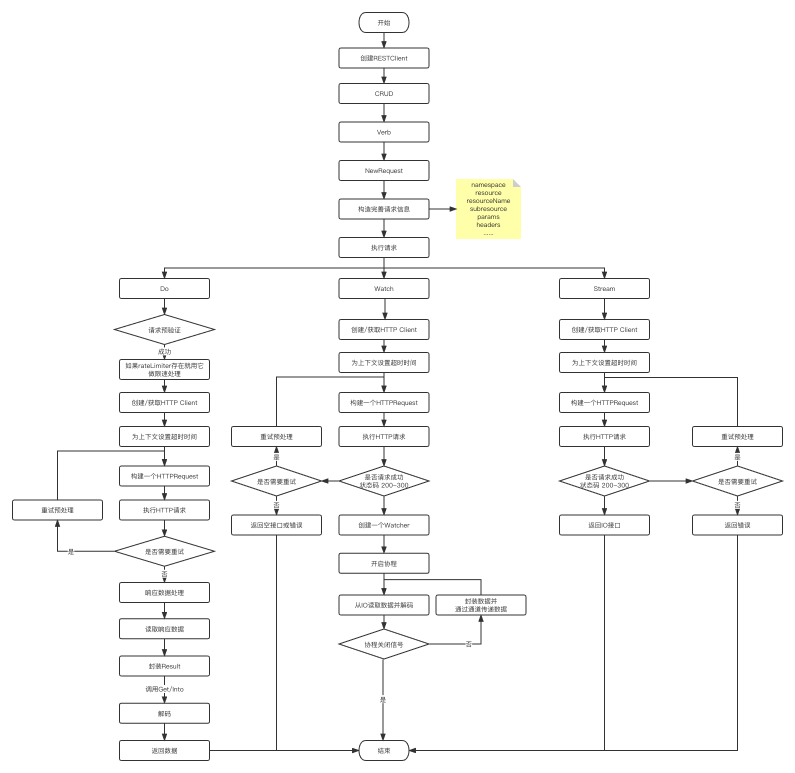

# RESTClient 详解
> RESTClient 是 Kubernetes API 请求的一个基础客户端，它封装了最基础的请求操作。
 
## 流程图

## 接口与结构体
### 结构体
RESTClient struct 将一些常规的资源与其进行了绑定。
```go
type RESTClient struct {
    //base 提供了一个最基础的客户端的URL，它通常是从我们传入的配置文件中获取，指向配置文件所在的集群。
    base *url.URL
    //versionedAPIPath 指的则是我们的APIPrefix GroupVersion, exp : apis/apps/v1
    versionedAPIPath string
    //content 则是提供了客户端内容的配置，其中包含解码和编码器，用于为传输的数据进行解码和编码
    content ClientContentConfig
    //createBackoffMgr 提供了一个用于创建BackoffManager的方法
    createBackoffMgr func() BackoffManager
    //rateLimiter 则是提供了一个限速器
    rateLimiter flowcontrol.RateLimiter
    warningHandler WarningHandler
    //http客户端
    Client *http.Client
}
```
在ClientContentConfig中提供了解码和编码的配置。其结构体如下：
```go
type ClientContentConfig struct {
    //客户端可接受的内容类型
    AcceptContentTypes string
	//ContentType 指定用于与服务器通信的内容格式。如果没有设置AcceptContentTypes，将会使用这个值作为AcceptContentTypes。
	//如果ContentType没有设置，则默认是 "application/json"。
    ContentType string
    //GroupVersion 提供了资源组和资源版本
    GroupVersion schema.GroupVersion
    //Negotiator 提供了解码和编码器
    Negotiator runtime.ClientNegotiator
}
```
### 接口
RESTClient Interface 定义了与K8S REST API 交互的一般操作。包常规的CRUD操作和获取限速器以及资源版本。
```go
type Interface interface {
    GetRateLimiter() flowcontrol.RateLimiter
    Verb(verb string) *Request
    Post() *Request
    Put() *Request
    Patch(pt types.PatchType) *Request
    Get() *Request
    Delete() *Request
    APIVersion() schema.GroupVersion
}
```
接下来我们看看它的接口实现，我们发现它的实现非常简单，主要是基于 Request 来实现。
它们仅仅是去创建一个 Request 然后设置一下 Verb，所以要想，深入了解，我们需要去看看 Request 的实现。
```go
func (c *RESTClient) Verb(verb string) *Request {
    return NewRequest(c).Verb(verb)
}

func (c *RESTClient) Post() *Request {
    return c.Verb("POST")
}

func (c *RESTClient) Put() *Request {
    return c.Verb("PUT")
}

func (c *RESTClient) Patch(pt types.PatchType) *Request {
    return c.Verb("PATCH").SetHeader("Content-Type", string(pt))
}

func (c *RESTClient) Get() *Request {...}

func (c *RESTClient) Delete() *Request {...}

```

# Request
## 结构
通过阅读Request结构体，我们可以发现，在Request中，它存储一个请求的各种信息，包含：
```go
type Request struct {
	//RESTClient rest 客户端
    c *RESTClient
    warningHandler WarningHandler
    rateLimiter flowcontrol.RateLimiter
    backoff     BackoffManager
    timeout     time.Duration
	//请求动作
    verb       string
	//前缀
    pathPrefix string
	//子路径
    subpath    string
	//参数
    params     url.Values
	//HTTP头
    headers    http.Header
	//资源命名空间
    namespace    string
    namespaceSet bool
	//资源类型
    resource     string
	//资源名称
    resourceName string
	//子资源
    subresource  string
    err   error
    body  io.Reader
    retry WithRetry
}
```
## 创建
而在 NewRequest 方法中,我们则可以发现，它其实是将RESTClient中的信息填充到 Request 中。
其他信息则是通过调用函数的方法传递进来。
```go
func NewRequest(c *RESTClient) *Request {
    var backoff BackoffManager
    if c.createBackoffMgr != nil {
        backoff = c.createBackoffMgr()
    }
    if backoff == nil {
        backoff = noBackoff
    }
    
    var pathPrefix string
    if c.base != nil {
        pathPrefix = path.Join("/", c.base.Path, c.versionedAPIPath)
    } else {
        pathPrefix = path.Join("/", c.versionedAPIPath)
    }
    
    var timeout time.Duration
    if c.Client != nil {
        timeout = c.Client.Timeout
    }
    
    r := &Request{
        c:              c,
        rateLimiter:    c.rateLimiter,
        backoff:        backoff,
        timeout:        timeout,
        pathPrefix:     pathPrefix,
        retry:          &withRetry{maxRetries: 10},
        warningHandler: c.warningHandler,
    }
    
    switch {
    case len(c.content.AcceptContentTypes) > 0:
        r.SetHeader("Accept", c.content.AcceptContentTypes)
    case len(c.content.ContentType) > 0:
        r.SetHeader("Accept", c.content.ContentType+", */*")
    }
    return r
}
```
## 数据填充
```go
// SubResource sets a sub-resource path which can be multiple segments after the resource
// name but before the suffix.
func (r *Request) SubResource(subresources ...string) *Request {
    ...
    r.subresource = subresource
	return r
}

// Name sets the name of a resource to access (<resource>/[ns/<namespace>/]<name>)
func (r *Request) Name(resourceName string) *Request {
    ...
    r.resourceName = resourceName
	return r
}

// Namespace applies the namespace scope to a request (<resource>/[ns/<namespace>/]<name>)
func (r *Request) Namespace(namespace string) *Request {
    ...
    r.namespaceSet = true
    r.namespace = namespace
	return r
}

// Param creates a query parameter with the given string value.
func (r *Request) Param(paramName, s string) *Request {
    ...
    return r.setParam(paramName, s)
}

func (r *Request) setParam(paramName, value string) *Request {
    if r.params == nil {
        r.params = make(url.Values)
    }
    r.params[paramName] = append(r.params[paramName], value)
    return r
}

func (r *Request) SetHeader(key string, values ...string) *Request {
    if r.headers == nil {
        r.headers = http.Header{}
    }
    r.headers.Del(key)
    for _, value := range values {
        r.headers.Add(key, value)
    }
    return r
}

func (r *Request) Timeout(d time.Duration) *Request {
    ...
    r.timeout = d
    return r
}
...只展示了部分代码
```
## URL构建

看完了如何为Request设置值，那我们来看看 Request 是如何将这些参数最终构建成用于向K8S服务请求的URL！
从下面代码，我们可以清晰的看出，Request 构建 URL 的方法非常简单:
先是按照一定的顺序，将我们开始设置的namespace,resource,resourceName,subpath 等信息拼接起来得到 URL 的 Path。
然后再将查询参数添加进去。
```go
// URL returns the current working URL.
func (r *Request) URL() *url.URL {
	//=======拼接 URL.Path========
    p := r.pathPrefix
    if r.namespaceSet && len(r.namespace) > 0 {
        p = path.Join(p, "namespaces", r.namespace)
    }
    if len(r.resource) != 0 {
        p = path.Join(p, strings.ToLower(r.resource))
    }
    // Join trims trailing slashes, so preserve r.pathPrefix's trailing slash for backwards compatibility if nothing was changed
    if len(r.resourceName) != 0 || len(r.subpath) != 0 || len(r.subresource) != 0 {
        p = path.Join(p, r.resourceName, r.subresource, r.subpath)
    }
    
    finalURL := &url.URL{}
    if r.c.base != nil {
        *finalURL = *r.c.base
    }
    finalURL.Path = p
	//=======构建 URL.RawQuery========
    query := url.Values{}
    for key, values := range r.params {
        for _, value := range values {
            query.Add(key, value)
        }
    }
    
    // timeout is handled specially here.
    if r.timeout != 0 {
        query.Set("timeout", r.timeout.String())
    }
    finalURL.RawQuery = query.Encode()
    return finalURL
}

```
另外还有一个 finalURLTemplate 函数也是用于构建 URL ，只是会比上述这个函数校验更加严格，更加符合 K8S 资源 API 路径规范。这里就不做详解了。
## 发起请求

构建完了URL路径，接下我们就来看看如何发起一个资源请求。
我们发起一个资源请求的方式通常有3种：
+ Do:执行某一个操作。即CRUD。
+ Watch：监听或观察一个数据的变动。
+ Stream: 获取数据流。

### Do
通过一下代码，我们可以看出，Do 主要做了两件事情，一件事情是发起 request 请求，另一件事情是将响应数据转换为 Result.
```go
func (r *Request) Do(ctx context.Context) Result {
    var result Result
	// 发起请求
    err := r.request(ctx, func(req *http.Request, resp *http.Response) {
		// 转换响应数据
        result = r.transformResponse(resp, req)
    })
    if err != nil {
        return Result{err: err}
    }
    return result
}
```
**发起请求**
先来看看发起请求时都做了啥。它的注释是这样说的：
> request connects to the server and invokes the provided function when a server response is
> received. It handles retry behavior and up front validation of requests. It will invoke
> fn at most once. It will return an error if a problem occurred prior to connecting to the
> server - the provided function is responsible for handling server errors.
>
> request 将会连接到服务器，并在接收到服务器的响应时调用提供的函数fn.但至多调用一次，
> 他会对请求进行预处理和处理相关的重试行为.
> 如果在连接到服务器前发生错误，将返回错误。
> 我们提供的函数也将负责处理服务器错误。
```go
func (r *Request) request(ctx context.Context, fn func(*http.Request, *http.Response)) error {
    //=====记录 request 请求的一些 metric 指标=====
    start := time.Now()
    defer func() {
        metrics.RequestLatency.Observe(ctx, r.verb, r.finalURLTemplate(), time.Since(start))
    }()
    
    if r.err != nil {
        klog.V(4).Infof("Error in request: %v", r.err)
        return r.err
    }
    /* 请求预验证，验证 namespace 为空的情况下，1 。请求不不能为POST。
	2 请求为GET，PUT，DELETE 时，资源名称不能为空*/
    if err := r.requestPreflightCheck(); err != nil {
        return err
    }
    
    client := r.c.Client
    if client == nil {
        client = http.DefaultClient
    }
    
    // 为上下文ctx设置一些超时的限制
    if err := r.tryThrottle(ctx); err != nil {
        return err
    }
    
    if r.timeout > 0 {
        var cancel context.CancelFunc
        ctx, cancel = context.WithTimeout(ctx, r.timeout)
        defer cancel()
    }
    
    // Right now we make about ten retry attempts if we get a Retry-After response.
    var retryAfter *RetryAfter
    for {
		//获取一个 http request 请求。
        req, err := r.newHTTPRequest(ctx)
        if err != nil {
            return err
        }
    
        r.backoff.Sleep(r.backoff.CalculateBackoff(r.URL()))
        if retryAfter != nil {
            // 使用限速器做重试处理
            if err := r.tryThrottleWithInfo(ctx, retryAfter.Reason); err != nil {
                return err
            }
            retryAfter = nil
        }
		//发起请求
        resp, err := client.Do(req)
		//更新metric
        updateURLMetrics(ctx, r, resp, err)
        if err != nil {
            r.backoff.UpdateBackoff(r.URL(), err, 0)
        } else {
            r.backoff.UpdateBackoff(r.URL(), err, resp.StatusCode)
        }
    
        done := func() bool {
			//读取和关闭响应body
            defer readAndCloseResponseBody(resp)
    
            //服务器响应处理，如果响应不为空，将会调用我们传递进来的处理方法。
            f := func(req *http.Request, resp *http.Response) {
                if resp == nil {
                    return
                }
                fn(req, resp)
            }
    
			//重试处理
            var retry bool
            retryAfter, retry = r.retry.NextRetry(req, resp, err, func(req *http.Request, err error) bool {
               if r.verb != "GET" {
                    return false
                }
                if net.IsConnectionReset(err) || net.IsProbableEOF(err) {
                    return true
                }
                return false
            })
            if retry {
                err := r.retry.BeforeNextRetry(ctx, r.backoff, retryAfter, req.URL.String(), r.body)
                if err == nil {
                    return false
                }
                klog.V(4).Infof("Could not retry request - %v", err)
            }
            // 调用上面定义好的服务器响应处理
            f(req, resp)
            return true
        }()
        if done {
            return err
        }
    }
}
```
通过阅读上面的代码和注释，我们可以发现，在发起 request 请求后，它做了以下动作：
1. request 函数会先对请求做一些简单的校验。
2. 为上下文ctx设置一些超时的限制。
3. 根据我们的开始构建的 Request 结构体数据， 构建一个 http Request 请求。
4. 使用限速器做重试处理，处理发生错误就退出并返回错误。
5. 执行请求。
6. 重试处理，
7. 处理服务器响应数据，如果服务器正确响应，则退出。响应失败则会回到第3步。

**转换响应数据**
转换响应数据主要是在服务器成功响应时，使用我们开始提供的解码器与服务器响应数据共同构建一个包含以下信息的结构体：
```go
type Result struct {
    //响应内容
    body        []byte
    warnings    []net.WarningHeader
    //内容类型
    contentType string
    //错误信息
    err         error
    //http 状态码
    statusCode  int
    //解码器
    decoder runtime.Decoder
}
```
同样的 Result 也为我们提供两个方法来获取数据,它们都在内部调用解码器，将数据转换为 k8s 的runtime.Object：
```go
func (r Result) Get() (runtime.Object, error) {
    if r.err != nil {
        return nil, r.Error()
    }
    if r.decoder == nil {
        return nil, fmt.Errorf("serializer for %s doesn't exist", r.contentType)
    }
    
    // decode, but if the result is Status return that as an error instead.
    out, _, err := r.decoder.Decode(r.body, nil, nil)
    if err != nil {
        return nil, err
    }
    switch t := out.(type) {
    case *metav1.Status:
        if t.Status != metav1.StatusSuccess {
            return nil, errors.FromObject(t)
        }
    }
    return out, nil
}

func (r Result) Into(obj runtime.Object) error {
    ... 和Get相同
    out, _, err := r.decoder.Decode(r.body, nil, obj)
    if err != nil || out == obj {
        return err
    }
    ... 和Get相同
    return nil
}
```
通过上面的代码阅读，我们知道了 Request 是如何去构建并发送一个常规的CURD请求的，并请求完成后如何处理响应数据的。

### Watch
我们在使用k8s的过程中，我们往往会使用 Watch 这个函数来监听一个数据的变化，以便数据发生修改时能给及时感知并同步。
它是怎么实现的，我们现在就可以来了解以下。

和Do相似，它会做一些重试设置，但它不会对请求进行预校验和使用限速器。
```go
func (r *Request) Watch(ctx context.Context) (watch.Interface, error) {
    // We specifically don't want to rate limit watches, so we
    // don't use r.rateLimiter here.
    if r.err != nil {
        return nil, r.err
    }
    
    client := r.c.Client
    if client == nil {
        client = http.DefaultClient
    }
    
    isErrRetryableFunc := func(request *http.Request, err error) bool {
        if net.IsProbableEOF(err) || net.IsTimeout(err) {
            return true
        }
        return false
    }
    var retryAfter *RetryAfter
    url := r.URL().String()
    for {
        //获取 HTTP Request
        req, err := r.newHTTPRequest(ctx)
        if err != nil {
            return nil, err
        }
    
        r.backoff.Sleep(r.backoff.CalculateBackoff(r.URL()))
        if retryAfter != nil {
            if err := r.tryThrottleWithInfo(ctx, retryAfter.Reason); err != nil {
                return nil, err
            }
            retryAfter = nil
        }
    
        //执行 HTTP Request
        resp, err := client.Do(req)
        updateURLMetrics(ctx, r, resp, err)
        if r.c.base != nil {
            if err != nil {
                r.backoff.UpdateBackoff(r.c.base, err, 0)
            } else {
                r.backoff.UpdateBackoff(r.c.base, err, resp.StatusCode)
            }
        }
        // 如果请求成功 创建并返回一个数据流观察者---StreamWatcher
        if err == nil && resp.StatusCode == http.StatusOK {
            return r.newStreamWatcher(resp)
        }
    
        // 请求失败，重试处理
        // 可以重试就继续重试，不可以重试就处理响应数据并返回错误。
        done, transformErr := func() (bool, error) {
            defer readAndCloseResponseBody(resp)
    
            //
            var retry bool
            retryAfter, retry = r.retry.NextRetry(req, resp, err, isErrRetryableFunc)
            if retry {
                err := r.retry.BeforeNextRetry(ctx, r.backoff, retryAfter, url, r.body)
                if err == nil {
                    return false, nil
                }
                klog.V(4).Infof("Could not retry request - %v", err)
            }
    
            if resp == nil {
                // the server must have sent us an error in 'err'
                return true, nil
            }
            if result := r.transformResponse(resp, req); result.err != nil {
                return true, result.err
            }
            return true, fmt.Errorf("for request %s, got status: %v", url, resp.StatusCode)
        }()
        if done {
            // 对于一些常见的网络错误，直接返回一个空的观察者
            if isErrRetryableFunc(req, err) {
                return watch.NewEmptyWatch(), nil
            }
            if err == nil {
                // if the server sent us an HTTP Response object,
                // we need to return the error object from that.
                err = transformErr
            }
            return nil, err
        }
    }
}
```

接下来我们看看他是怎么创建数据流观察者(StreamWatcher)的。
1. 获取 contentType。
2. 将 contentTyp 解析为 mediaType 和 params。
3. 根据 mediaType 和 params 从 Request 的流式 StreamDecoder 中获取 objectDecoder，streamingSerializer，framer。
4. 获取 frameReader，watchEventDecoder。
5. 调用 watch.NewStreamWatcher 创建 StreamWatcher。
```go
func (r *Request) newStreamWatcher(resp *http.Response) (watch.Interface, error) {
    contentType := resp.Header.Get("Content-Type")
    mediaType, params, err := mime.ParseMediaType(contentType)
    if err != nil {
        klog.V(4).Infof("Unexpected content type from the server: %q: %v", contentType, err)
    }
    objectDecoder, streamingSerializer, framer, err := r.c.content.Negotiator.StreamDecoder(mediaType, params)
    if err != nil {
        return nil, err
    }
    
    handleWarnings(resp.Header, r.warningHandler)
    
    frameReader := framer.NewFrameReader(resp.Body)
    watchEventDecoder := streaming.NewDecoder(frameReader, streamingSerializer)
    
    return watch.NewStreamWatcher(
        restclientwatch.NewDecoder(watchEventDecoder, objectDecoder),
        errors.NewClientErrorReporter(http.StatusInternalServerError, r.verb, "ClientWatchDecoding"),
    ), nil
}
```
然后我们通过查看NewStreamWatcher 会发现，这个在函数返回了一个StreamWatcher的同时，开启了一个协程进行服务。
在协程中不断的通过资源解码器获取资源和事件类型，然后通过通道将数据传输出去。
```go
func NewStreamWatcher(d Decoder, r Reporter) *StreamWatcher {
    sw := &StreamWatcher{
        source:   d,
        reporter: r,
        result: make(chan Event),
        done: make(chan struct{}),
    }
    go sw.receive()
    return sw
}
// receive reads result from the decoder in a loop and sends down the result channel.
func (sw *StreamWatcher) receive() {
    defer utilruntime.HandleCrash()
    defer close(sw.result)
    defer sw.Stop()
    for {
        action, obj, err := sw.source.Decode()
        if err != nil {
            switch err {
            case io.EOF:
            case io.ErrUnexpectedEOF:
                klog.V(1).Infof("Unexpected EOF during watch stream event decoding: %v", err)
            default:
                if net.IsProbableEOF(err) || net.IsTimeout(err) {
                    klog.V(5).Infof("Unable to decode an event from the watch stream: %v", err)
                } else {
                    select {
                    case <-sw.done:
                    case sw.result <- Event{
                        Type:   Error,
                        Object: sw.reporter.AsObject(fmt.Errorf("unable to decode an event from the watch stream: %v", err)),
                    }:
                    }
                }
            }
            return
        }
        select {
        case <-sw.done:
            return
        case sw.result <- Event{
            Type:   action,
            Object: obj,
        }:
        }
    }
}
```
### Stream
Stream 是用来获取一个数据流，它的做法相较于watch而言，则是比较简单的，
仅仅只是在请求成功时返回 IO Reader。
```go
func (r *Request) Stream(ctx context.Context) (io.ReadCloser, error) {
	...
	url := r.URL().String()
	for {
		req, err := r.newHTTPRequest(ctx)
		...

		resp, err := client.Do(req)
		...

		switch {
		case (resp.StatusCode >= 200) && (resp.StatusCode < 300):
			handleWarnings(resp.Header, r.warningHandler)
			return resp.Body, nil

		default:
			...
		}
	}
}
```
## 对比
经过上面的介绍，我们应该大概解了RESTClient是怎么样工作的了，但是为什么是k8s其他客户端的基础呢？我们可以通过一个例子看出来:
我们对比一下使用 RESTClient , ClientSet 以及 DynamicClient 来获取pod，大家应该就理解了。
我们可以看到，ClientSet，DynamicClient 最终都是调用 RESTClient 里面的 方法来进行请求。
```go
//获取配置
func getConfig() *rest.Config {
	config, err := clientcmd.BuildConfigFromFlags("", "xxx")
	if err != nil {
		panic(err)
	}
	return config
}
```
### RESTClient
```go
func restClient() {
    //config
    config := getConfig()
    config.GroupVersion = &v1.SchemeGroupVersion
    config.NegotiatedSerializer = scheme.Codecs
    config.APIPath = "/api"
    //client
    client, err := rest.RESTClientFor(config)
    if err != nil {
        panic(err)
    }
    // get data
    var pod v1.Pod
    req := client.Get().
		Namespace("default").
		Resource("pods").
		Name("xxx").
		Do(context.TODO()).
		Into(&pod)
    if err != nil {
        fmt.Println(err)
    } else {    
		fmt.Println(pod.Name)
    }
}
```

### ClientSet

```go
func clientCmd() {
    config := getConfig()
    clientSet, err := kubernetes.NewForConfig(config)
    if err != nil {
        panic(err)
    }
    pod, err := clientSet.CoreV1().Pods("default").Get(context.TODO(), "xxx", v12.GetOptions{})
    if err != nil {
        fmt.Println(err)
    } else {
        fmt.Println(pod.Name)
    }
}

func (c *pods) Get(ctx context.Context, name string, options metav1.GetOptions) (result *v1.Pod, err error) {
    result = &v1.Pod{}
    err = c.client.Get().
        Namespace(c.ns).
        Resource("pods").
        Name(name).
        VersionedParams(&options, scheme.ParameterCodec).
        Do(ctx).
        Into(result)
    return
}

type pods struct {
    client rest.Interface
    ns     string
}

// newPods returns a Pods
func newPods(c *CoreV1Client, namespace string) *pods {
    return &pods{
        client: c.RESTClient(),
        ns:     namespace,
    }
}
```

### DynamicClient

```go
func dynamicCli() {
	resource := schema.GroupVersionResource{Group: "", Version: "v1", Resource: "pods"}
	config := getConfig()
	cli, err := dynamic.NewForConfig(config)
	if err != nil {
		panic(err)
	}
	pod, err := cli.Resource(resource).Namespace("default").Get(context.TODO(), "xxx",v12.GetOptions{})
	if err != nil {
		fmt.Println(err)
	}  else {
		fmt.Println(pod.GetName())
	}
}

func (c *dynamicResourceClient) Get(ctx context.Context, name string, opts metav1.GetOptions, subresources ...string) (*unstructured.Unstructured, error) {
    if len(name) == 0 {
        return nil, fmt.Errorf("name is required")
    }
    result := c.client.client.Get().
		AbsPath(append(c.makeURLSegments(name), subresources...)...).
		SpecificallyVersionedParams(&opts, dynamicParameterCodec, versionV1).
		Do(ctx)
    if err := result.Error(); err != nil {
        return nil, err
    }
    retBytes, err := result.Raw()
    if err != nil {
        return nil, err
    }
    uncastObj, err := runtime.Decode(unstructured.UnstructuredJSONScheme, retBytes)
    if err != nil {
        return nil, err
    }
    return uncastObj.(*unstructured.Unstructured), nil
}

type dynamicClient struct {
    client *rest.RESTClient
}

type dynamicResourceClient struct {
    client    *dynamicClient
    namespace string
    resource  schema.GroupVersionResource
}
```