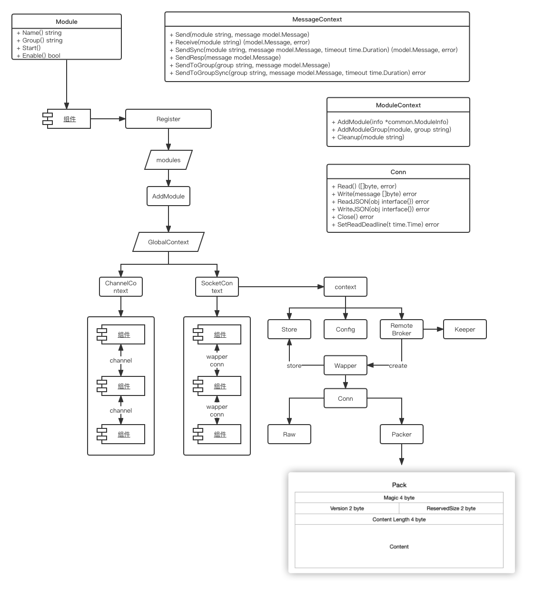
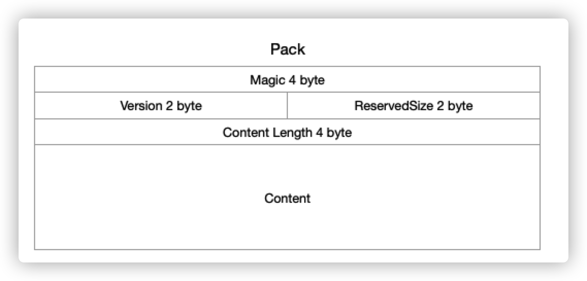

# 概述

core 模块是 kubeedge 的<font color="#ff0000">核心模块</font>，它负责管理所有模块的启动与停止，同时也负责多模块间的<font color="#ffff00">通信</font>，它当前主要由: model, context, socket, channel 四个部分组成，其中：
1. model 部分定义了消息的模型，这个消息模型是各个组件间通信所必须符合的规范。
2. context 部分定义了消息的上下文以及模块上下文两个接口，同时使用了一个全局上下文来管理各个类型的上下文。
3. socket 部分则实现了socket 类型的上下文通信，主要用于非本地通信。
4. channel 部分则实现了channel 类型的上下文通信，主要用于本地通信。

# 结构



# Model --- 消息模型

在 model 中定义了消息的模型， 其主要结构如下：

```go
type Message struct {  
   Header  MessageHeader `json:"header"`  
   Router  MessageRoute  `json:"route,omitempty"`  
   Content interface{}   `json:"content"`  
}
```

Header 为消息头，Router 为消息路由，Content 为消息本体。

## Header --- 消息头

消息头中主要定义了一些消息头部的详细信息，其结构如下：

```go
type MessageHeader struct {  
   //消息的ID,使用UUID生成。 
   ID string `json:"msg_id"`  
   //消息的父ID，一般在响应消息时候填充，其一般要与请求消息的ID相同
   ParentID string `json:"parent_msg_id,omitempty"`  
   //消息的创建时间
   Timestamp int64 `json:"timestamp"`  
   //消息的特定资源版本，目前保存的是 k8s 资源的版本。
   //kubeedge利用消息资源版本的概念来实现可靠传输。
   ResourceVersion string `json:"resourceversion,omitempty"`  
   //发送同步的标志位，该标志将在 sendsync 中设置。
   Sync bool `json:"sync,omitempty"`  
   //船渡消息的类型，一般为 channel，unixsocket 等类型，如果为空，则默认是 channel 类型
   MessageType string `json:"type,omitempty"`  
}
```

## Router --- 消息路由

消息路由中定义了消息的一些操作和目的地等信息，其结构如下：

```go
type MessageRoute struct {  
   //消息的来源
   Source string `json:"source,omitempty"`  
   //消息的目的地
   Destination string `json:"destination,omitempty"`  
   //消息广播的时候需要广播到哪个组
   Group string `json:"group,omitempty"`  
   //如何去操作资源
   Operation string `json:"operation,omitempty"`  
   //想要操作的资源类型是什么
   Resource string `json:"resource,omitempty"`  
}
```

### 资源操作

描述了可以对资源进行哪些操作：

```go
const (
   InsertOperation        = "insert"  
   DeleteOperation        = "delete"  
   QueryOperation         = "query"  
   UpdateOperation        = "update"  
   PatchOperation         = "patch"  
   UploadOperation        = "upload"  
   ResponseOperation      = "response"  
   ResponseErrorOperation = "error"
)
```

### 资源类型

描述了由哪些资源类型：

```go
const (
   ResourceTypePod                 = "pod"  
   ResourceTypeConfigmap           = "configmap"  
   ResourceTypeServiceAccountToken = "serviceaccounttoken"  
   ResourceTypeSecret              = "secret"  
   ResourceTypeNode                = "node"  
   ResourceTypePodlist             = "podlist"  
   ResourceTypePodStatus           = "podstatus"  
   ResourceTypePodPatch            = "podpatch"  
   ResourceTypeNodeStatus          = "nodestatus"  
   ResourceTypeNodePatch           = "nodepatch"  
   ResourceTypeRule                = "rule"  
   ResourceTypeRuleEndpoint        = "ruleendpoint"  
   ResourceTypeRuleStatus          = "rulestatus"  
   ResourceTypeLease               = "lease"  
)
```

# Context --- 上下文

## ModuleContext --- 模块上下文

ModuleContext 接口定义了如何将 module 加入到当前 context,  并将其分组，以及，结束时如何清理模块的接口：

```go
type ModuleContext interface {  
   AddModule(info *common.ModuleInfo)  
   AddModuleGroup(module, group string)  
   Cleanup(module string)  
}
```

## MessageContext --- 消息上下文

MessageContext 接口定义了上下文如何为各个模块发送,接收,同步以及广播消息：

```go
type MessageContext interface {  
   // async mode  
   Send(module string, message model.Message)  
   Receive(module string) (model.Message, error)  
   // sync mode  
   SendSync(module string, message model.Message, timeout time.Duration) (model.Message, error)  
   SendResp(message model.Message)  
   // group broadcast  
   SendToGroup(group string, message model.Message)  
   SendToGroupSync(group string, message model.Message, timeout time.Duration) error  
}
```

当前这个两个接口的实现，在 kubeedge 中，主要是由 socket 部分和 channel 部分对其进行了实现，分别用于远程模块通信与本地模块通信。

## GlobalContext --- 全局上下文

GlobalContext 主要用来管理 module , message 与 Context 间的关系，以及提供一些方法，来便捷的操作 context, 其主要结构如下：

```go
type GlobalContext struct {
   // 存储 context 类型与 ModuleContext 接口间关系
   // key 为 context 类型，value 为对应的 ModuleContext 接口
   moduleContext  map[string]ModuleContext
   // 存储 context 类型与 MessageContext 接口间关系  
   // key 为 context 类型，value 为对应的 MessageContext 接口
   messageContext map[string]MessageContext  
   // 存储 module 与 context 类型间的关系
   // key 为 module 名称，value 为对应的 context 类型
   moduleContextType map[string]string  
   // 存储 group 与 context 类型间的关系
   // key 为 group 名称，value 为对应的 context 类型 
   groupContextType map[string]string  
  
   ctx     gocontext.Context  
   cancel  gocontext.CancelFunc  
   ctxLock sync.RWMutex  
}
```

### 方法

```go
// 根据传入的 contextTypes 初始化 context
InitContext(contextTypes []string)
// 获取 context
GetContext() gocontext.Context
// 结束
Done() <-chan struct{}
// 取消
Cancel()
// 添加 module
AddModule(module *common.ModuleInfo)
// 添加 module group
AddModuleGroup(module, group string)
// 清理 module
Cleanup(module string)
// 发送消息到模块
Send(module string, message model.Message)
// 接收模块的消息
Receive(module string) (model.Message, error)
// 发送同步消息
SendSync(module string,message model.Message, timeout time.Duration)(model.Message, error)
// 发送响应消息
SendResp(resp model.Message)
// 发送广播消息
SendToGroup(group string, message model.Message)
// 发送同步广播消息
SendToGroupSync(group string, message model.Message, timeout time.Duration) error
```


# Channel Context

## 数据结构

通信类型的 Context 主要用于本地通信，即程序内部不同模块间的交互。其结构如下：

```go
type Context struct {
   // 存储 module 与 channel 的关系
   // key 为模块名称， value 为 对应的 channel
   // 默认channel 缓冲区大小为1024
   channels     map[string]chan model.Message  
   chsLock      sync.RWMutex
   // 存储 group , module 与 channel 的关系
   // 第一层 key 为 group
   // 第二层 key 为 module ,vaule 为 channel
   typeChannels map[string]map[string]chan model.Message  
   typeChsLock  sync.RWMutex 
   // 匿名通道map
   // 存储 message 与 channel 的关系
   // key 为 messageID ，value 为 channel
   anonChannels map[string]chan model.Message  
   anonChsLock  sync.RWMutex  
}
```

## 方法

### ModuleContext 接口实现

#### AddModule

1. 创建一个类型为 model.Message 类型的，带缓冲区的 channel ,通道大小默认为1024。
2. 将数据存入 channels map，key 为模块名称， value 为 对应的 channel

> 代码不是源码，为了方便展示整合过

```go
func (ctx *Context) AddModule(info *common.ModuleInfo) {  
   channel := make(chan model.Message, ChannelSizeDefault) 
   ctx.channels[module] = moduleCh  
}
```

#### AddModuleGroup

1. 根据 module 名称从 channels map 中获取 channel 
2. 获取成功：
	1. 判断 typeChannels map 中是否存在对应的group， 不存在就初始化一个。
	2. 存在就将对应 module ，group，channel 存储起来
3. 获取失败就输出警告


> 代码不是源码，为了方便展示整合过

```go
func (ctx *Context) AddModuleGroup(module, group string) {
   if _,ok := ctx.channels[module]; ok {  
      if _, exist := ctx.typeChannels[group]; !exist {  
        ctx.typeChannels[group] = make(map[string]chan model.Message)  
      }  
      ctx.typeChannels[group][module] = ctx.typeChannels[group] 
      return  
   }  
   klog.Warningf("Get bad module name %s when addmodulegroup", module)  
}
```


#### Cleanup

1. 根据 module 从 channels map 获取 channel
2. 获取成功：
	1. 从 channels map 删除数据
	2. 从 typeChannels map 删除数据
	3. sleep 20 Millisecond 以减少通道关闭的可能异常
	4. 关闭 channel


> 代码不是源码，为了方便展示整合过

```go
func (ctx *Context) Cleanup(module string) {  
   if _,ok := ctx.channels[module]; ok {  
      delete(ctx.channels, module) 
      for _, moduleMap := range ctx.typeChannels {  
         if _, exist := moduleMap[module]; exist {  
            delete(moduleMap, module)  
            break  
         }  
      } 
      // decrease probable exception of channel closing  
      time.Sleep(20 * time.Millisecond)  
      close(channel)  
   }  
}
```

### MessageContext 接口实现

#### Send

1. 根据 module 获取 channel
2. 往 channel 写 message


> 代码不是源码，为了方便展示整合过

```go
func (ctx *Context) Send(module string, message model.Message) {  
   if channel := ctx.getChannel(module); channel != nil {  
      channel <- message  
      return  
   }  
}
```


#### Receive

1. 根据 module 获取 channel
2. 从 channel 读 message


> 代码不是源码，为了方便展示整合过

```go
func (ctx *Context) Receive(module string) (model.Message, error) {  
   if channel := ctx.getChannel(module); channel != nil {  
      content := <-channel  
      return content, nil  
   }  
   return model.Message{}, fmt.Errorf("failed to get channel for module(%s)", module)  
}
```

#### SendSync

1. 设置 deadline 即超时时间, 传入 timeout <= 0 时，默认为30s
2. 将消息头 Sync 标志为设置为 true
3. 根据 module 获取 channel : reqChannel
4. 创建一个匿名 channel 存入 anonChannels map， key 为 messageID
5. 创建一个defer 用来删除刚刚创建的匿名 channel
6. 往 reqChannel 写 message
7. 写超时就返回发送消息超时错误
8. 未超时就等待匿名通道返回响应消息
9. 响应超时就返回接收响应消息超时错误


> 代码不是源码，为了方便展示整合过

```go
func (ctx *Context) SendSync(module string, message model.Message, timeout time.Duration) (model.Message, error) {  
   if timeout <= 0 {  
      timeout = MessageTimeoutDefault  
   }  
   deadline := time.Now().Add(timeout)  
  
   // make sure to set sync flag  
   message.Header.Sync = true  
  
   // check req/resp channel  
   reqChannel := ctx.getChannel(module)  
   if reqChannel == nil {  
      return model.Message{}, fmt.Errorf("bad request module name(%s)", module)  
   }  
  
   // new anonymous channel for response  
   anonChan := make(chan model.Message)  
   anonName := getAnonChannelName(message.GetID())  
   ctx.anonChsLock.Lock()  
   ctx.anonChannels[anonName] = anonChan  
   ctx.anonChsLock.Unlock()  
   defer func() {  
      ctx.anonChsLock.Lock()  
      delete(ctx.anonChannels, anonName)  
      close(anonChan)  
      ctx.anonChsLock.Unlock()  
   }()  
  
   select {  
   case reqChannel <- message:  
   case <-time.After(timeout):  
      return model.Message{}, fmt.Errorf("timeout to send message %s", message.GetID())  
   }  
  
   var resp model.Message  
   select {  
   case resp = <-anonChan:  
   case <-time.After(time.Until(deadline)):  
      return model.Message{}, fmt.Errorf("timeout to get response for message %s", message.GetID())  
   }  
  
   return resp, nil  
}
```


#### SendResp

1. 根据 messageID 从 anonChannels map 获取 channel
2. 往匿名 channel 写 message


> 代码不是源码，为了方便展示整合过

```go
func (ctx *Context) SendResp(message model.Message) {  
   anonName := getAnonChannelName(message.GetParentID())  
   if channel, exist := ctx.anonChannels[anonName]; exist {  
      select {  
      case channel <- message:  
      default:
      }  
      return  
   } 
}
```

#### SendToGroup

1. 根据 group 从 typeChannels map 获取当前 group 下的 channel map
2. 遍历 channel map
3. 往 channel 写 message


> 代码不是源码，为了方便展示整合过

```go
func (ctx *Context) SendToGroup(moduleType string, message model.Message) {  
   send := func(module string, ch chan model.Message) {  
      select {  
      case ch <- message:  
      default:  
         ch <- message  
      }  
   }  
   if channelList := ctx.getTypeChannel(moduleType); channelList != nil {  
      for module, channel := range channelList {  
         go send(module, channel)  
      }  
      return  
   }
}
```

#### SendToGroupSync

1. 设置 deadline 即超时时间, 传入 timeout <= 0 时，默认为30s
2. 根据 group 从 typeChannels map 获取当前 group 下的 channel map
3. 创建一个匿名 channel 存入 anonChannels map， key 为 messageID, 缓冲区大小为 channel map 的大小
4. 创建一个defer 用来删除刚刚创建的匿名 channel，
5. 将消息头 Sync 标志为设置为 true
7. 遍历 channel map ，开启多协程往 channel 写 message
8. 写超时就将 timeoutCounter ++
9. 等待匿名通道返回响应消息
10. 响应超时就返回接收响应消息超时错误
11. 清理刚刚创建匿名 channel


> 代码不是源码，为了方便展示整合过

```go
func (ctx *Context) SendToGroupSync(moduleType string, message model.Message, timeout time.Duration) error {  
   if timeout <= 0 {  
      timeout = MessageTimeoutDefault  
   }  
   deadline := time.Now().Add(timeout)  
  
   channelList := ctx.getTypeChannel(moduleType)  
   if channelList == nil {  
      return fmt.Errorf("failed to get module type(%s) channel list", moduleType)  
   }  
  
   // each module must sync a response,  
   // let anonchan size be module number   channelNumber := len(channelList)  
   anonChan := make(chan model.Message, channelNumber)  
   anonName := getAnonChannelName(message.GetID())  
   ctx.anonChsLock.Lock()  
   ctx.anonChannels[anonName] = anonChan  
   ctx.anonChsLock.Unlock()  
  
   cleanup := func() error {  
      ctx.anonChsLock.Lock()  
      delete(ctx.anonChannels, anonName)  
      close(anonChan)  
      ctx.anonChsLock.Unlock()  
  
      var uninvitedGuests int  
      // cleanup anonchan and check parentid for resp  
      for resp := range anonChan {  
         if resp.GetParentID() != message.GetID() {  
            uninvitedGuests++  
         }  
      }  
      if uninvitedGuests != 0 {
         return fmt.Errorf("got some unexpected(%d) resp", uninvitedGuests)  
      }  
      return nil  
   }  
  
   // make sure to set sync flag before sending  
   message.Header.Sync = true  
  
   var timeoutCounter int32  
   send := func(ch chan model.Message) {  
      // avoid exception because of channel closing  
      // TODO: need reconstruction  
      defer func() {  
         if exception := recover(); exception != nil {  
            klog.Warningf("xxx")  
         }  
      }()  
      sendTimer := time.NewTimer(time.Until(deadline))  
      select {  
      case ch <- message:  
         sendTimer.Stop()  
      case <-sendTimer.C:  
         atomic.AddInt32(&timeoutCounter, 1)  
      }  
   }  
   for _, channel := range channelList {  
      go send(channel)  
   }  
  
   sendTimer := time.NewTimer(time.Until(deadline))  
   ticker := time.NewTicker(TickerTimeoutDefault)  
   for {  
      if len(anonChan) == channelNumber {  
         break  
      }  
      select {  
      case <-ticker.C:  
      case <-sendTimer.C:  
         err := cleanup()  
         if err != nil {  
            klog.Errorf("Failed to cleanup, error: %v", err)  
         }  
         if timeoutCounter != 0 {  
            return fmt.Errorf("xxx")  
         }  
         return fmt.Errorf("timeout to send message")  
      }  
   }  
  
   return cleanup()  
}
```

# Socket Context

socket 部分主要用于远程信息交换，底层通过 net.conn 获取连接。它主要有以下几个部分组成：

+ broker: 网络代理
+ config: 配置
+ socket: socket module
+ stroe: 通信存储
+ keeper: 心跳保持
+ wapper: 消息打包

## 主体

### 数据结构

外层的Context 只负责实现 MessageContext 与 ModuleContext 接口和存储实际用于通信的 context。对应 MessageContext 接口实现也是调用 通信context 的方法来实现。


```go
type Context struct {  
   // 存储 module 与 context 的关系
   // key 为 module，value 为 context
   contexts map[string]*context  
   // 存储 group 与 context 的关系
   // key 为 module，value 为 context
   groups map[string]*context  
   sync.RWMutex  
}

type context struct {  
   name       string  
   address    string  
   moduleType string  
   bufferSize int  
  
   certificate tls.Certificate  
   store       *store.PipeStore  
   broker      *broker.RemoteBroker  
}
```


而在 context 中：
+ 消息通讯主要使用 broker 进行
+ module 存储 则主要使用 store 进行

所以，接下来，我们主要看一下 broker 与  store 的实现。

## broker

### 数据结构

broker 是一个消息代理，它的内部，持有一个心跳保持对象：

``` go
type RemoteBroker struct {  
   keeper *synckeeper.Keeper  
}
```

同时还有一个用于建联的配置选项数据结构：

```go 
type ConnectOptions struct {  
   Address     string  
   MessageType string  
   BufferSize  int  
   Cert        tls.Certificate  
  
   // for websocket/http  
   RequestHeader http.Header  
}
```

### 方法

#### Connect
1. 调用 ConnectFunc 获取 net.Conn
2. 新建一个消息包装对象

```go
func (broker *RemoteBroker) Connect(opts ConnectOptions, connect ConnectFunc) wrapper.Conn {  
   conn, err := connect(opts)  
   ...
   return wrapper.NewWrapper(opts.MessageType, conn, opts.BufferSize)  
}

func Connect(opts broker.ConnectOptions) (interface{}, error) {  
   conn, err := net.Dial(opts.MessageType, opts.Address)  
   ... 
   return conn, nil  
}

func NewWrapper(connType string, conn interface{}, buffSize int) Conn {  
   readerType := reader.ReaderTypeRaw  
   writerType := writer.WriterTypeRaw  
  
   return &ConnWrapper{  
      conn:   conn,  
      reader: reader.NewReader(readerType, conn, buffSize),  
      writer: writer.NewWriter(writerType, conn),  
   }  
}
```


#### Send

1. 调用 conn 的 WriteJSON 发送消息

```go
func (broker *RemoteBroker) Send(conn wrapper.Conn, message model.Message) error {  
   err := conn.WriteJSON(&message)  
   ...  
   return nil  
}
```

#### Receive

1. 设置超时时间---无
2. 调用 conn 的 ReadJSON 读取消息
3. 判断消息是否是同步响应消息
4. 不是就返回消息
5. 是就发送心跳保持消息

```go
func (broker *RemoteBroker) Receive(conn wrapper.Conn) (model.Message, error) {  
   var message model.Message  
   for {  
      err := conn.SetReadDeadline(time.Time{})  
      err = conn.ReadJSON(&message)  
      ...
      isResponse := broker.keeper.IsSyncResponse(message.GetParentID())  
      if !isResponse {  
         return message, nil  
      }  
      err = broker.keeper.SendToKeepChannel(message)  
   }  
}
```

#### SendSyncInternal

1. 设置超时时间，默认10s
2. 设置同步标志位
3. 调用 conn 的 WriteJSON 发送消息
4. 发送失败就返回错误
5. 成功就调用 conn 的 ReadJSON 等待响应消息
6. 响应超时返回错误
7. 响应成功就返回响应消息

```go
func (broker *RemoteBroker) SendSyncInternal(conn wrapper.Conn, message model.Message, timeout time.Duration) (model.Message, error) {  
   if timeout <= 0 {  
      timeout = syncMessageTimeoutDefault  
   }  
  
   // make sure to set sync flag  
   message.Header.Sync = true  
  
   err := conn.WriteJSON(&message)  
   ...
   deadline := time.Now().Add(timeout)  
   err = conn.SetReadDeadline(deadline)  
   var response model.Message  
   err = conn.ReadJSON(&response)  
   ...
   return response, nil  
}
```

## Store

### 数据结构

```go
type PipeStore struct {
   // key module
   pipeMap          map[string]PipeInfo  
   pipeMapLock      sync.RWMutex  
   // key group module
   groupPipeMap     map[string]map[string]PipeInfo  
   groupPipeMapLock sync.RWMutex  
}

type PipeInfo struct {  
   pipe interface{}  
}
```

PipeInfo 存储的是一个通信对象，主要有以下几种:
+ chan model.Message
+ net.Conn
+ wrapper.Conn

方法就不过多介绍，与其他模块差异不大，因为它主要的功能就是存储。所以都是CRUD。

## Wapper

wapper 包装了一个自定义的网络连接，定一个了Conn接口。其数据结构如下：

```go
type Conn interface {  
   Read() ([]byte, error)  
   Write(message []byte) error  
  
   ReadJSON(obj interface{}) error  
   WriteJSON(obj interface{}) error  
  
   Close() error  
  
   SetReadDeadline(t time.Time) error  
}  
  
// ConnWrapper conn wrapper
type ConnWrapper struct {  
   conn   interface{}  
   reader reader.Reader  
   writer writer.Writer  
}
```

对与 Conn 接口，她的实际实现主要有两种(纯粹实现就只有 ConnWrapper，但是实际上 ConnWrapper 也是调用的底层实现)，Raw 和 Package 两种，其中：

+ Raw: 就是常规的buffer 实现，直接通过 net.Conn 进行操作
+ Package：则是自定义的一个消息协议，将消息封装后在通过 net.Conn 通信。

### Packer

> 当前未使用

Packer 自定义了通信协议，它将每条消息的前12个字节作为消息头。
+ [:4] 魔术位--无实义 4 字节 
+ (4:6] 版本位--存储版本号 2字节
+ (6:8] 保留位 2字节
+ (8:12] 长度位 -- 存储消息长度 4字节



```go
const (  
   magicSize    = 4  
   versionSize  = 2  
   reservedSize = 2  
  
   // MessageLenOffest message len offest   
   MessageLenOffest = magicSize + versionSize + reservedSize  
   // MessageOffset message offset   
   MessageOffset = MessageLenOffest + 4  
   // HeaderLen header len   
   HeaderLen = MessageOffset  
)
type Packer struct {  
   Magic    [magicSize]byte  
   Version  [versionSize]byte  
   Reserved [reservedSize]byte  
   Length   int32  
   Message  []byte  
}
```

#### Read

```go
func (p *Packer) Read(reader io.Reader) error {
   // 读取魔术位
   err := binary.Read(reader, binary.BigEndian, &p.Magic)  
   ... 
   // 读取版本位
   err = binary.Read(reader, binary.BigEndian, &p.Version)  
   ... 
   // 读取保留位 
   err = binary.Read(reader, binary.BigEndian, &p.Reserved)  
   ...
   // 读取长度位
   err = binary.Read(reader, binary.BigEndian, &p.Length)  
   ... 
   // 读取消息实体
   err = binary.Read(reader, binary.BigEndian, &p.Message)  
   ...
   return err  
}
```

#### Write

```go
var (  
   headerTags = [HeaderLen]byte{'b', 'e', 'e', 'h', 'v', '1', 'r', 'v', 0, 0, 0, 0}  
)

func (p *Packer) Write(writer io.Writer) error {  
   // 通过位运算写入数据长度
   headerTags[MessageLenOffest] = byte(uint32(p.Length) >> 24)  
   headerTags[MessageLenOffest+1] = byte(uint32(p.Length) >> 16)  
   headerTags[MessageLenOffest+2] = byte(uint32(p.Length) >> 8)  
   headerTags[MessageLenOffest+3] = byte(uint32(p.Length)) 
   // 写入消息头 
   err := binary.Write(writer, binary.BigEndian, &headerTags)  
   ... 
   // 写入消息实体
   err = binary.Write(writer, binary.BigEndian, &p.Message)  
   ... 
   return nil  
}
```


到此，我们基本上介绍完了它的内部核心实现，接下来，我们来看看的外层包装

# Module

我们在上述的章节中一直提到了 modlue 这样一个概念，在 kubeedge 中，它通过 Module 这样一个接口来约定，只要实现了这个接口，kubeedge 就认为你是一个 modlue。

```go
type Module interface {  
   Name() string  
   Group() string  
   Start()  
   Enable() bool  
}
```

core 模块通过 ModuleInfo 存储单个 modlue 的信息，各个模块则使用 Register() 方法将自己注册进来，然后所有的 ModuleInfo 会存储到 modules map 和 disabledModules map 中，并通过 GetModules() 方法将 module 暴露出去。

```go
var (  
   // Modules map  
   modules         map[string]*ModuleInfo  
   disabledModules map[string]*ModuleInfo  
)
type ModuleInfo struct {  
   contextType string  
   remote      bool  
   module      Module  
}

func Register(m Module, opts ...string) {  
   info := &ModuleInfo{  
      module:      m,  
      contextType: common.MsgCtxTypeChannel,  
      remote:      false,  
   }  
  
   if len(opts) > 0 {  
      info.contextType = opts[0]  
      info.remote = true  
   }  
  
   if m.Enable() {  
      modules[m.Name()] = info  
   } else {  
      disabledModules[m.Name()] = info  
   }  
}
func GetModules() map[string]*ModuleInfo {  
   return modules  
}
```

## StartModules

1. 默认初始化 Context 为 channel 类型
2. 获取所有已注册的 modules
3. 遍历 modules 将各个 module 加入到Context
4. 启动 module

```go
func StartModules() {  
   // only register channel mode, if want to use socket mode, we should also pass in common.MsgCtxTypeUS parameter  
   beehiveContext.InitContext([]string{common.MsgCtxTypeChannel})  
  
   modules := GetModules()  
  
   for name, module := range modules {  
      var m common.ModuleInfo  
      switch module.contextType {  
      case common.MsgCtxTypeChannel:  
         m = common.ModuleInfo{  
            ModuleName: name,  
            ModuleType: module.contextType,  
         }  
      case common.MsgCtxTypeUS:  
         m = common.ModuleInfo{  
            ModuleName: name,  
            ModuleType: module.contextType,  
            // the below field ModuleSocket is only required for using socket.  
            ModuleSocket: common.ModuleSocket{  
               IsRemote: module.remote,  
            },  
         }  
      default:  
         klog.Exitf("unsupported context type: %s", module.contextType)  
      }  
  
      beehiveContext.AddModule(&m)  
      beehiveContext.AddModuleGroup(name, module.module.Group())  
  
      go moduleKeeper(name, module, m)  
      klog.Infof("starting module %s", name)  
   }  
}

func moduleKeeper(name string, moduleInfo *ModuleInfo, m common.ModuleInfo) {  
   for {  
      moduleInfo.module.Start()  
      // local modules are always online  
      if !moduleInfo.remote {  
         return  
      }  
      // try to add module for remote modules  
      beehiveContext.AddModule(&m)  
      beehiveContext.AddModuleGroup(name, moduleInfo.module.Group())  
   }  
}
```

## GracefulShutdown

1. 开启一个通道接收系统信号
2. 接收到信号就执行 Context.Cancel() 方法
3. 获取所有已注册的 modules
4. 调用 Context.Cleanup()  方法 清理module.

```go
func GracefulShutdown() {  
   c := make(chan os.Signal, 1)  
   signal.Notify(c, syscall.SIGINT, syscall.SIGHUP, syscall.SIGTERM,  
      syscall.SIGQUIT, syscall.SIGILL, syscall.SIGTRAP, syscall.SIGABRT)  
   s := <-c  
   klog.Infof("Get os signal %v", s.String())  
  
   // Cleanup each modules  
   beehiveContext.Cancel()  
   modules := GetModules()  
   for name := range modules {  
      klog.Infof("Cleanup module %v", name)  
      beehiveContext.Cleanup(name)  
   }  
}
```