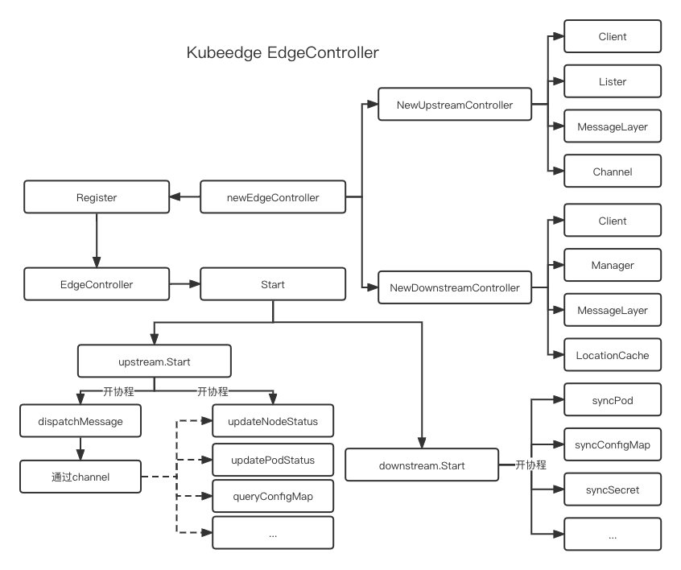

# 概述

Edgecontroller 是 Kubernetes apiserver 与 Edgecore 之间的桥梁，负责两者间的通信与协议转换。

其核心为：
+ UpstreamController(上行消息控制器)：负责从边缘订阅消息并同步到 kubernetes api server。
+ DownstreamController(下行消息控制器)：负责抓取 kubernetes api server 更改并将更改发送到边缘。

# 结构



# EdgeController

对于 EdgeController 而言，它所做的事情非常简单，它主要就是将自己注册到 Core 中，并且使用 config 实例化 <font color="#ff0000">UpstreamController</font>，<font color="#ff0000">DownstreamController</font> 。然后在 Core 启动该模块时启动 UpstreamController 与 DownstreamController。

## Register

1. 根据配置实例化上行控制器--UpstreamController
2. 根据配置实例化下行控制器--DownstreamController

```go
func Register(ec *v1alpha1.EdgeController) {  
   core.Register(newEdgeController(ec))  
}

func newEdgeController(config *v1alpha1.EdgeController) *EdgeController {  
   ec := &EdgeController{config: *config}  
   if !ec.Enable() {  
      return ec  
   }  
   var err error  
   ec.upstream, err = controller.NewUpstreamController(config, informers.GetInformersManager().GetK8sInformerFactory())  
   ... 
   ec.downstream, err = controller.NewDownstreamController(config, informers.GetInformersManager().GetK8sInformerFactory(), informers.GetInformersManager(), informers.GetInformersManager().GetCRDInformerFactory())  
   ... 
   return ec  
}
```

## Start

1. 启动上行控制器
2. 启动下行控制器

```go
func (ec *EdgeController) Start() {  
   if err := ec.upstream.Start(); err != nil {  
      klog.Exitf("start upstream failed with error: %s", err)  
   }  
  
   if err := ec.downstream.Start(); err != nil {  
      klog.Exitf("start downstream failed with error: %s", err)  
   }  
}
```

# UpstreamController

对于上下控制器而言，它的主要作用就是订阅边缘的消息，然后进行协议转换和处理后，发送给 k8s apiserver。

## 创建上行控制器实例---NewUpstreamController

NewUpstreamController 方法主要作用就是创建一个 UpstreamController 实例，其主要流程如下：

1. 获取 k8s 相关客户端
2. 获取消息传输层实例
3. 获取各类资源Lister---Node，Pod，ConfigMap，Secret，Lease
4. 创建各类资源数据的处理通道

```go
func NewUpstreamController(config *v1alpha1.EdgeController, factory k8sinformer.SharedInformerFactory) (*UpstreamController, error) {  
   uc := &UpstreamController{  
      kubeClient:   client.GetKubeClient(),  
      messageLayer: messagelayer.EdgeControllerMessageLayer(),  
      crdClient:    client.GetCRDClient(),  
      config:       *config,  
   }
   //获取各类资源Lister
   uc.nodeLister = factory.Core().V1().Nodes().Lister()  
   ... 
   //创建各类资源数据的处理通道
   uc.nodeStatusChan = make(chan model.Message, config.Buffer.UpdateNodeStatus) 
   uc.podStatusChan = make(chan model.Message, config.Buffer.UpdatePodStatus) 
   ...
   return uc, nil  
}
```

## 启动控制器---Start

Start 的主要作用就是启动 UpstreamController 实例，开始接收来自消息层的消息，然后分发给各个函数处理，其主要流程如下：

1. 开协程进行消息分发处理---dispatchMessage
2. 根据配置开协程处理各类资源消息
	1. updateNodeStatus
	2. updatePodStatus
	3. queryConfigMap
	4. querySecret
	5. processServiceAccountToken
	6. ... --- 太多了，不一一例举了

```go
func (uc *UpstreamController) Start() error {  
   klog.Info("start upstream controller")  
   //开协程进行消息分发处理
   go uc.dispatchMessage()  
   //根据配置开协程处理各类资源消息
   for i := 0; i < int(uc.config.Load.UpdateNodeStatusWorkers); i++ {  
      go uc.updateNodeStatus()  
   }  
   for i := 0; i < int(uc.config.Load.UpdatePodStatusWorkers); i++ {  
      go uc.updatePodStatus()  
   }  
   ...
   return nil  
}
```

## 分发消息---dispatchMessage

dispatchMessage 主要用于从消息层接收消息，并根据资源类型的不同，通过不同的通道将消息分发不同的处理函数。其主要流程如下：

1. 开启循环
2. 接收到结束信号就退出循环
3. 接收到消息就获取并判断资源类型
4. 根据资源类型和操作将消息通过不同的通道将消息分发不同的处理函数

### 资源类型

```go
const (  
   ResourceTypePod                 = "pod"  
   ResourceTypeConfigmap           = "configmap"  
   ResourceTypeServiceAccountToken = "serviceaccounttoken"  
   ResourceTypeSecret              = "secret"  
   ResourceTypeNode                = "node"  
   ResourceTypePodlist             = "podlist"  
   ResourceTypePodStatus           = "podstatus"  
   ResourceTypePodPatch            = "podpatch"  
   ResourceTypeNodeStatus          = "nodestatus"  
   ResourceTypeNodePatch           = "nodepatch"  
   ResourceTypeRule                = "rule"  
   ResourceTypeRuleEndpoint        = "ruleendpoint"  
   ResourceTypeRuleStatus          = "rulestatus"  
   ResourceTypeLease               = "lease"  
)
```

### 操作类型

```go
const (  
   InsertOperation        = "insert"  
   DeleteOperation        = "delete"  
   QueryOperation         = "query"  
   UpdateOperation        = "update"  
   PatchOperation         = "patch"  
   UploadOperation        = "upload"  
   ResponseOperation      = "response"  
   ResponseErrorOperation = "error"  
)
```

### 方法

```go
func (uc *UpstreamController) dispatchMessage() {  
   for {  
      select { 
      // 接收到结束信号就退出循环
      case <-beehiveContext.Done():  
         return  
      default:  
      }  
      //接收到消息
      msg, err := uc.messageLayer.Receive()  
      if err != nil {  
         continue  
      }  
      //获取资源类型
      resourceType, err := messagelayer.GetResourceType(msg)  
      if err != nil {   
         continue  
      }
      //判断资源类型  
      //根据资源类型和操作将消息通过不同的通道将消息分发不同的处理函数
      switch resourceType {  
      case model.ResourceTypeNodeStatus:  
         uc.nodeStatusChan <- msg  
      case model.ResourceTypePodStatus:  
         uc.podStatusChan <- msg  
      case model.ResourceTypeConfigmap:  
         uc.configMapChan <- msg  
      case model.ResourceTypeSecret:  
         uc.secretChan <- msg  
      case model.ResourceTypeServiceAccountToken:  
         uc.serviceAccountTokenChan <- msg  
      case common.ResourceTypePersistentVolume:  
         uc.persistentVolumeChan <- msg  
      case common.ResourceTypePersistentVolumeClaim:  
         uc.persistentVolumeClaimChan <- msg  
      case common.ResourceTypeVolumeAttachment:  
         uc.volumeAttachmentChan <- msg  
      case model.ResourceTypeNode:  
         switch msg.GetOperation() {  
         case model.InsertOperation:  
            uc.createNodeChan <- msg  
         case model.QueryOperation:  
            uc.queryNodeChan <- msg  
         case model.UpdateOperation:  
            uc.updateNodeChan <- msg  
         default:  
         }  
      case model.ResourceTypeNodePatch:  
         uc.patchNodeChan <- msg  
      case model.ResourceTypePodPatch:  
         uc.patchPodChan <- msg  
      case model.ResourceTypePod:  
         if msg.GetOperation() == model.DeleteOperation {  
            uc.podDeleteChan <- msg  
         } 
      case model.ResourceTypeRuleStatus:  
         uc.ruleStatusChan <- msg  
      case model.ResourceTypeLease:  
         switch msg.GetOperation() {  
         case model.InsertOperation, model.UpdateOperation:  
            uc.createLeaseChan <- msg  
         case model.QueryOperation:  
            uc.queryLeaseChan <- msg  
         }  
      default:  
      }  
   }  
}
```

## 资源处理函数

大部分资源处理函数都只是将消息进行转换后，进行了简单的判断，然后就将实际的资源根据请求的资源类型和操作去请求 k8s apiserver 了。在这里我就不过多叙述了，只举一个例子给大家看就懂了。

### 常规资源处理

#### 常规资源请求方法--kubeClientGet

这个方法主要用于去请求一些常规的资源，在控制器中，被多个地方调用它的上层封装函数 queryInner。它的主要流程就非常简单：

1. 判断请求的什么资源
2. 请求k8s apiserver 获取资源
3. 返回资源和错误信息

```go
func kubeClientGet(uc *UpstreamController, namespace string, name string, queryType string, msg model.Message) (metaV1.Object, error) {  
   var obj metaV1.Object  
   var err error  
   switch queryType {  
   case model.ResourceTypeConfigmap:  
      obj, err = uc.configMapLister.ConfigMaps(namespace).Get(name)  
   case model.ResourceTypeSecret:  
      obj, err = uc.secretLister.Secrets(namespace).Get(name)  
   case common.ResourceTypePersistentVolume:  
      obj, err = uc.kubeClient.CoreV1().PersistentVolumes().Get(context.Background(), name, metaV1.GetOptions{})  
   case common.ResourceTypePersistentVolumeClaim:  
      obj, err = uc.kubeClient.CoreV1().PersistentVolumeClaims(namespace).Get(context.Background(), name, metaV1.GetOptions{})  
   case common.ResourceTypeVolumeAttachment:  
      obj, err = uc.kubeClient.StorageV1().VolumeAttachments().Get(context.Background(), name, metaV1.GetOptions{})  
   case model.ResourceTypeNode:  
      obj, err = uc.nodeLister.Get(name)  
   case model.ResourceTypeServiceAccountToken:  
      obj, err = uc.getServiceAccountToken(namespace, name, msg)  
   case model.ResourceTypeLease:  
      obj, err = uc.leaseLister.Leases(namespace).Get(name)  
   default:  
      err = stderrors.New("wrong query type")  
   }  
   if err != nil {  
      return nil, err  
   }  
   if err := util.SetMetaType(obj.(runtime.Object)); err != nil {  
      return nil, err  
   }  
   return obj, nil  
}
```

#### 资源请求方法--queryInner

它的主要作用是解析消息本体，获取消息中包含的 k8s 资源信息，然后根据这些信息去调用下层的常规资源请求方法 kubeClientGet 去获取资源数据,请求成功就再次通过消息层将请求的数据包装成私有协议后发送出去。其主要流程如下：

1. 解析消息中包含的 k8s 资源信息
2. 判断是不是请求操作
3. 是就调用下层的常规资源请求方法 kubeClientGet 获取资源数据
4. 获取成功就调用消息层包装资源数据成私有协议
5. 调用消息层发送包装后的消息

```go
func queryInner(uc *UpstreamController, msg model.Message, queryType string) {  
   //解析消息中包含的 k8s 资源信息
   namespace, err := messagelayer.GetNamespace(msg)  
   if err != nil {  
      return  
   }  
   name, err := messagelayer.GetResourceName(msg)  
   if err != nil {  
      return  
   }  
   //判断是不是请求操作
   switch msg.GetOperation() {  
   case model.QueryOperation: 
      // 调用下层的常规资源请求方法 kubeClientGet 获取资源数据
      object, err := kubeClientGet(uc, namespace, name, queryType, msg)  
      if errors.IsNotFound(err) {  
         return  
      }  
      if err != nil {  
         return  
      }  
  
      nodeID, err := messagelayer.GetNodeID(msg)  
      if err != nil {  
         return  
      }  
      //调用消息层包装资源数据成私有协议
      resource, err := messagelayer.BuildResource(nodeID, namespace, queryType, name)  
      if err != nil {  
         return  
      }  
      //调用消息层发送包装后的消息
      resMsg := model.NewMessage(msg.GetID()).  
         SetResourceVersion(object.GetResourceVersion()).  
         FillBody(object).  
         BuildRouter(modules.EdgeControllerModuleName, constants.GroupResource, resource, model.ResponseOperation)  
      err = uc.messageLayer.Response(*resMsg)  
      if err != nil {  
         return  
      }   
   default:  
   }  
}
```


#### 例子:查询ConfigMap --- queryConfigMap

主要流程如下：
1. 开启循环
2. 从通道接收消息
3. 如果是结束通道传来的消息就退出函数
4. 如果是消息通道传来的消息，就接收消息，然后交给资源请求方法(queryInner)处理。

```go
func (uc *UpstreamController) queryConfigMap() {  
   for {  
      select {  
      case <-beehiveContext.Done():  
         return  
      case msg := <-uc.configMapChan:  
         queryInner(uc, msg, model.ResourceTypeConfigmap)  
      }  
   }  
}
```

### 更新节点状态 --- updateNodeStatus(已弃用)

主要作用就是更新节点的状态，其流程如下：

> 接收退出信号和消息信号就不再过多赘述了，直接介绍处理流程。

1. 获取 k8s 资源相关的消息(命名空间，资源名称等)
2. 判断需要对消息进行的操作
3. 新增操作：
	1. 先从 k8s apiserver 查询该节点资源，查询到就返回资源已存在，不用创建
	2. 查询错误如果不是资源不存在就返回错误消息
	3. 该节点资源不存在就调用  k8s  client 创建节点资源
	4. 创建失败就返回失败消息，成功就返回成功消息
4. 更新操作：
	1. 先从 k8s apiserver 查询该节点资源，不存在就打印错误消息
	2. 存在就更新资源状态里的心跳时间信息
	3. 为节点资源设置Annotations
	4. 更新资源状态信息
	5. 调用  k8s  client 更新节点状态信息
	6. 调用消息层返回更新节点资源成功的消息

```go
func (uc *UpstreamController) updateNodeStatus() {  
   for {  
      select {  
      case <-beehiveContext.Done():  
         return  
      case msg := <-uc.nodeStatusChan:  
         data, err := msg.GetContentData()  
         if err != nil {  
            continue  
         }  
         namespace, err := messagelayer.GetNamespace(msg)  
         if err != nil {  
            continue  
         }  
         name, err := messagelayer.GetResourceName(msg)  
         if err != nil {  
            continue  
         }  
  
         switch msg.GetOperation() {  
         case model.InsertOperation:  
            _, err := uc.kubeClient.CoreV1().Nodes().Get(context.Background(), name, metaV1.GetOptions{})  
            if err == nil {   
               uc.nodeMsgResponse(name, namespace, common.MessageSuccessfulContent, msg)  
               continue  
            }  
  
            if !errors.IsNotFound(err) {  
               uc.nodeMsgResponse(name, namespace, errLog, msg)  
               continue  
            }  
  
            node := &v1.Node{}  
            err = json.Unmarshal(data, node)  
            if err != nil {  
               uc.nodeMsgResponse(name, namespace, errLog, msg)  
               continue  
            }  
  
            if _, err = uc.createNode(name, node); err != nil {  
               uc.nodeMsgResponse(name, namespace, errLog, msg)  
               continue  
            }  
  
            uc.nodeMsgResponse(name, namespace, common.MessageSuccessfulContent, msg)  
  
         case model.UpdateOperation:  
            nodeStatusRequest := &edgeapi.NodeStatusRequest{}  
            err := json.Unmarshal(data, nodeStatusRequest)  
            if err != nil {  
               continue  
            }  
  
            getNode, err := uc.kubeClient.CoreV1().Nodes().Get(context.Background(), name, metaV1.GetOptions{})  
            if errors.IsNotFound(err) {  
               continue  
            }  
  
            if err != nil {  
               continue  
            }  
            for i := range nodeStatusRequest.Status.Conditions {  
               if time.Since(nodeStatusRequest.Status.Conditions[i].LastHeartbeatTime.Time) > time.Duration(uc.config.NodeUpdateFrequency)*time.Second {  
                  nodeStatusRequest.Status.Conditions[i].LastHeartbeatTime = metaV1.NewTime(time.Now())  
               }  
            }  
  
            if getNode.Annotations == nil {  
               getNode.Annotations = make(map[string]string)  
            }  
            for name, v := range nodeStatusRequest.ExtendResources {  
               if name == constants.NvidiaGPUScalarResourceName {  
                  var gpuStatus []types.NvidiaGPUStatus  
                  for _, er := range v {  
                     gpuStatus = append(gpuStatus, types.NvidiaGPUStatus{ID: er.Name, Healthy: true})  
                  }  
                  if len(gpuStatus) > 0 {  
                     data, _ := json.Marshal(gpuStatus)  
                     getNode.Annotations[constants.NvidiaGPUStatusAnnotationKey] = string(data)  
                  }  
               }  
               data, err := json.Marshal(v)  
               if err != nil {  
                  continue  
               }  
               getNode.Annotations[string(name)] = string(data)  
            }  
  
            if getNode.Status.DaemonEndpoints.KubeletEndpoint.Port != 0 {  
               nodeStatusRequest.Status.DaemonEndpoints.KubeletEndpoint.Port = getNode.Status.DaemonEndpoints.KubeletEndpoint.Port  
            }  
  
            getNode.Status = nodeStatusRequest.Status  
  
            node, err := uc.kubeClient.CoreV1().Nodes().UpdateStatus(context.Background(), getNode, metaV1.UpdateOptions{})  
            if err != nil {  
               continue  
            }  
  
            nodeID, err := messagelayer.GetNodeID(msg)  
            if err != nil {  
               continue  
            }  
  
            resource, err := messagelayer.BuildResource(nodeID, namespace, model.ResourceTypeNode, name)  
            if err != nil {  
               continue  
            }  
  
            resMsg := model.NewMessage(msg.GetID()).  
               SetResourceVersion(node.ResourceVersion).  
               FillBody(common.MessageSuccessfulContent).  
               BuildRouter(modules.EdgeControllerModuleName, constants.GroupResource, resource, model.ResponseOperation)  
            if err = uc.messageLayer.Response(*resMsg); err != nil { 
               continue  
            }  
  
         default:  
            continue  
         }  
      }  
   }  
}
```


其他的上行消息处理都是比较简单的，我在这里就不一一例举了，其大概的处理流程如下：
1. 获取信息
2. 判断操作什么资源
3. 判断对资源需要做什么操作
4. 进行一定的处理
5. 根据对应的资源类型和操作类型请求 k8s api server
6. 如果需要响应请求，就调用消息层构建并响应消息。

# DownstreamController

DownstreamController 主要用于接收 k8s apiserver 的变更事件信息，然后经过协议转换，发送给边缘。

## 创建下行控制器实例---NewDownstreamController

NewDownstreamController 主要作用是创建一个 DownstreamController 实例，其主要流程如下：

1. 获取一个本地缓存实例存储节点和 ConfigMap,Secret 间的关系
2. 获取 k8s client
3. 获取各类 manager 管理各类资源的变化事件
4. 获取消息层用于发送消息给边缘
5. 初始化本地缓存

```go
func NewDownstreamController(config *v1alpha1.EdgeController, k8sInformerFactory k8sinformers.SharedInformerFactory, keInformerFactory informers.KubeEdgeCustomInformer,  
   crdInformerFactory crdinformers.SharedInformerFactory) (*DownstreamController, error) {  
   //获取一个本地缓存实例
   lc := &manager.LocationCache{}  
   //获取各类 manager 管理各类资源的变化事件
   podInformer := k8sInformerFactory.Core().V1().Pods()  
   podManager, err := manager.NewPodManager(config, podInformer.Informer())  
   if err != nil {    
      return nil, err  
   }  
  
   configMapInformer := k8sInformerFactory.Core().V1().ConfigMaps()  
   configMapManager, err := manager.NewConfigMapManager(config, configMapInformer.Informer())  
   if err != nil {   
      return nil, err  
   }  
  
   secretInformer := k8sInformerFactory.Core().V1().Secrets()  
   secretManager, err := manager.NewSecretManager(config, secretInformer.Informer())  
   if err != nil {   
      return nil, err  
   }  
   nodeInformer := keInformerFactory.EdgeNode()  
   nodesManager, err := manager.NewNodesManager(nodeInformer)  
   if err != nil {    
      return nil, err  
   }  
  
   rulesInformer := crdInformerFactory.Rules().V1().Rules().Informer()  
   rulesManager, err := manager.NewRuleManager(config, rulesInformer)  
   if err != nil {   
      return nil, err  
   }  
  
   ruleEndpointsInformer := crdInformerFactory.Rules().V1().RuleEndpoints().Informer()  
   ruleEndpointsManager, err := manager.NewRuleEndpointManager(config, ruleEndpointsInformer)  
   if err != nil { 
      return nil, err  
   }  
  
   dc := &DownstreamController{  
      //获取 k8s client
      kubeClient:           client.GetKubeClient(),  
      podManager:           podManager,  
      configmapManager:     configMapManager,  
      secretManager:        secretManager,  
      nodeManager:          nodesManager,  
      //获取消息层用于发送消息给边缘
      messageLayer:         messagelayer.EdgeControllerMessageLayer(),  
      lc:                   lc,  
      podLister:            podInformer.Lister(),  
      rulesManager:         rulesManager,  
      ruleEndpointsManager: ruleEndpointsManager,  
   }  
   //初始化本地缓存
   if err := dc.initLocating(); err != nil {  
      return nil, err  
   }  
  
   return dc, nil  
}
```

## 启动控制器---Start

下行控制器的启动和上行控制器的启动一样非常简单，就是开启协程处理各类事件：

```go
func (dc *DownstreamController) Start() error {  
   klog.Info("start downstream controller")  
   // pod  
   go dc.syncPod()  
  
   // configmap  
   go dc.syncConfigMap()  
  
   // secret  
   go dc.syncSecret()  
  
   // nodes  
   go dc.syncEdgeNodes()  
  
   // rule  
   go dc.syncRule()  
  
   // ruleendpoint  
   go dc.syncRuleEndpoint()  
  
   return nil  
}
```

## 本地缓存 --- LocationCache

在上游控制器中，我们提到过 LocationCache 的作用主要就是用于本地缓存，缓存节点和 ConfigMap,Secret 间的关系，这样做主要是为了能给在 ConfigMap 和 Secret 发生变更是能够快速知道有哪些节点在使用，然后下发给对应节点。其数据结构如下：

```go
type LocationCache struct {  
   //EdgeNodes 用于存储边缘 nodeName，把Map用作了Set
   EdgeNodes sync.Map  
   // configMapNode 用于储存 node 和 ConfigMap 间的关系，
   // key 是 namespace/configMapName, value 是 nodeName   
   configMapNode sync.Map  
   // configMapNode 用于储存 node 和 secret 间的关系，
   // key 是 namespace/configMapName, value 是 nodeName 
   secretNode sync.Map  
}
```

我们接下来看看它的几个关键的处理方法：

### 初始化 --- initLocating

initLocating 函数用于下行控制器创建的时候初始化本地缓存这个实例，在初始化的时候，其主要流程如下：

1. 创建一个用于获取边缘节点的labelSelector
2. 从 k8s client 查询节点数据
3. 更新本地缓存的边缘节点信息
4. 查询 k8s 集群 所有 pod信息
5. 判断 pod 是不是边缘节点的 pod
6. 是就使用 pod 的里的信息更新本地缓存

```go
func (dc *DownstreamController) initLocating() error { 
   //创建一个用于获取边缘节点的labelSelector
   set := labels.Set{commonconstants.EdgeNodeRoleKey: commonconstants.EdgeNodeRoleValue}  
   selector := labels.SelectorFromSet(set)  
   //从 k8s client 查询节点数据
   nodes, err := dc.kubeClient.CoreV1().Nodes().List(context.Background(), metav1.ListOptions{LabelSelector: selector.String()})  
   if err != nil {  
      return err  
   } 
   //更新本地缓存的边缘节点信息
   for _, node := range nodes.Items {  
      dc.lc.UpdateEdgeNode(node.ObjectMeta.Name)  
   }  
   //查询 k8s 集群 所有 pod信息
   pods, err := dc.kubeClient.CoreV1().Pods(v1.NamespaceAll).List(context.Background(), metav1.ListOptions{})  
   if err != nil {  
      return err  
   }  
   for _, p := range pods.Items {  
	  //判断 pod 是不是边缘节点的 pod
      if dc.lc.IsEdgeNode(p.Spec.NodeName) {
         //是就使用 pod 的里的信息更新本地缓存 
         dc.lc.AddOrUpdatePod(p)  
      }  
   }  
  
   return nil  
}
```

### 缓存边缘节点信息 --- UpdateEdgeNode

缓存节点信息则是直接将节点名称存入 map 。

```go
func (lc *LocationCache) UpdateEdgeNode(nodeName string) {  
   lc.EdgeNodes.Store(nodeName, struct{}{})  
}
```

### 判断节点是否是边缘节点 --- IsEdgeNode

对应判断是否是边缘节点，则直接查询 EdgeNodes 这个 map，如果能够查出来就说明是边缘节点，如果不能，就说明不是。

**为什么可以这样判断？**

> 因为我们初始化本地缓存的时候就将所有的边缘节点查询出来加入了 EdgeNodes 这个map。

```go
func (lc *LocationCache) IsEdgeNode(nodeName string) bool {  
   _, ok := lc.EdgeNodes.Load(nodeName)  
   return ok  
}
```

### 根据 Pod 添加或更新缓存信息 --- AddOrUpdatePod

AddOrUpdatePod 方法主要作用是将 Pod 用到的 ConfigMap 和 Secret 信息从 Pod 中拿出来进行缓存，这样的话，我们就能在 ConfigMap 或 Secret 发生变更的时候及时通知给对应边缘。

主要流程如下：
1. 从 pod 中获取用到的 ConfigMaps 和 Secrets.
2. 判断 configMapNode 中有没有对应的 configMapKey 和 nodeName
3. 没有就将缺失的数据将入进去，有就忽略。
4. 判断 secretNode 中有没有对应的 secretKey 和 nodeName
5. 没有就将缺失的数据将入进去，有就忽略。

```go
func (lc *LocationCache) AddOrUpdatePod(pod v1.Pod) {  
   configMaps, secrets := lc.PodConfigMapsAndSecrets(pod)  
   for _, c := range configMaps {  
      configMapKey := fmt.Sprintf("%s/%s", pod.Namespace, c)  
      // update configMapPod  
      value, ok := lc.configMapNode.Load(configMapKey)  
      var newNodes []string  
      if ok {  
         nodes, _ := value.([]string)  
         newNodes = lc.newNodes(nodes, pod.Spec.NodeName)  
      } else {  
         newNodes = []string{pod.Spec.NodeName}  
      }  
      lc.configMapNode.Store(configMapKey, newNodes)  
   }  
  
   for _, s := range secrets {  
      secretKey := fmt.Sprintf("%s/%s", pod.Namespace, s)  
      // update secretPod  
      value, ok := lc.secretNode.Load(secretKey)  
      var newNodes []string  
      if ok {  
         nodes, _ := value.([]string)  
         newNodes = lc.newNodes(nodes, pod.Spec.NodeName)  
      } else {  
         newNodes = []string{pod.Spec.NodeName}  
      }  
      lc.secretNode.Store(secretKey, newNodes)  
   }  
}
```

### 从 Pod 中获取 ConfigMaps & Secrets --- PodConfigMapsAndSecrets

该函数主要用于从 Pod 中获取该 Pod 用到的ConfigMaps & Secrets。 其主要流程如下：

1. 遍历 pod 的 Volumes 获取 ConfigMaps & Secrets
2. 遍历 pod 的 Containers 的 envs 获取 ConfigMaps & Secrets
3.  遍历 pod 的 ImagePullSecrets 获取   Secrets

```go
func (lc *LocationCache) PodConfigMapsAndSecrets(pod v1.Pod) (configMaps, secrets []string) {  
   for _, v := range pod.Spec.Volumes {  
      if v.ConfigMap != nil {  
         configMaps = append(configMaps, v.ConfigMap.Name)  
      }  
      if v.Secret != nil {  
         secrets = append(secrets, v.Secret.SecretName)  
      }  
      if v.Projected != nil {  
         for _, source := range v.Projected.Sources {  
            switch {  
            case source.ConfigMap != nil:  
               configMaps = append(configMaps, source.ConfigMap.Name)  
            case source.Secret != nil:  
               secrets = append(secrets, source.Secret.Name)  
            }  
         }  
      }  
   }  
   // used by envs  
   for _, s := range pod.Spec.Containers {  
      for _, ef := range s.EnvFrom {  
         if ef.ConfigMapRef != nil {  
            configMaps = append(configMaps, ef.ConfigMapRef.Name)  
         }  
         if ef.SecretRef != nil {  
            secrets = append(secrets, ef.SecretRef.Name)  
         }  
      }  
      for _, e := range s.Env {  
         if e.ValueFrom == nil {  
            continue  
         }  
  
         if e.ValueFrom.ConfigMapKeyRef != nil {  
            configMaps = append(configMaps, e.ValueFrom.ConfigMapKeyRef.Name)  
         } else if e.ValueFrom.SecretKeyRef != nil {  
            secrets = append(secrets, e.ValueFrom.SecretKeyRef.Name)  
         }  
      }  
   }  
   // used by ImagePullSecrets  
   for _, s := range pod.Spec.ImagePullSecrets {  
      secrets = append(secrets, s.Name)  
   }  
   return  
}
```

## 公共事件管理器 --- CommonResourceEventHandler

公共事件管理器，主要用来接收来自 k8s apiserver informer 的事件消息，然后将该事件消息通过通道传递出去。

其数据结构如下：

```go
type CommonResourceEventHandler struct {  
   events chan watch.Event  
}
```

它实现了 cache 包的 ResourceEventHandler 接口用来接收事件通知。

```go
type ResourceEventHandler interface {  
   OnAdd(obj interface{})  
   OnUpdate(oldObj, newObj interface{})  
   OnDelete(obj interface{})  
}

func (c *CommonResourceEventHandler) OnAdd(obj interface{}) {  
   c.obj2Event(watch.Added, obj)  
}  
func (c *CommonResourceEventHandler) OnUpdate(oldObj, newObj interface{}) {  
   c.obj2Event(watch.Modified, newObj)  
}  
func (c *CommonResourceEventHandler) OnDelete(obj interface{}) {  
   c.obj2Event(watch.Deleted, obj)  
}

func (c *CommonResourceEventHandler) obj2Event(t watch.EventType, obj interface{}) {  
   eventObj, ok := obj.(runtime.Object)  
   if !ok {  
      klog.Warningf("unknown type: %T, ignore", obj)  
      return  
   } 
   err := util.SetMetaType(eventObj)  
   if err != nil {  
      klog.Warningf("failed to set meta type :%v", err)  
   }  
   c.events <- watch.Event{Type: t, Object: eventObj}  
}
```

定义了 Manager 接口用来发送消息。用来传递事件消息。

```go
type Manager interface {  
   Events() chan watch.Event  
}
```

### 创建事件管理器

```go
func NewCommonResourceEventHandler(events chan watch.Event) *CommonResourceEventHandler {  
   return &CommonResourceEventHandler{events: events}  
}
```

## 节点事件管理

节点事件管理器实现了公共事件管理器的接口。其代码如下：

```go
type NodesManager struct {  
   events chan watch.Event  
}  
// manager 接口实现
func (nm *NodesManager) Events() chan watch.Event {  
   return nm.events  
}  
// 创建一个节点事件管理器
func NewNodesManager(si cache.SharedIndexInformer) (*NodesManager, error) {  
   events := make(chan watch.Event)  
   //获取一个公共事件管理器实例
   rh := NewCommonResourceEventHandler(events)  
   //注册到 Informer
   si.AddEventHandler(rh)  
  
   return &NodesManager{events: events}, nil  
}
```

我们可以看到它的实现非常简单，主要就是利用 informer 和 CommonResourceEventHandler 的能力进行事件传递。

其他的如：

1. ConfigMapManager
2. SecretManager
3. RuleManager
4. RuleEndpointManager

都是如上的实现，只要 PodManager 有异同。

## Pod 事件管理器 --- PodManager

PodManager 与其他事件管理器的不同是因为它对事件消息进行了合并和缓存后，然后再将消息传递下行控制器处理。

它拥有两个通道，一个通道用来接收来自 api server 事件消息，一个通道用来传递合并后的事件信息。

```go
type PodManager struct {  
   // 接收来自 api server 事件消息 
   realEvents chan watch.Event  
  
   // 用来传递合并后的事件信息
   mergedEvents chan watch.Event  
  
   // pods, key 是 UID, value 是 *v1.Pod  
   pods sync.Map  
}
```

观察下面代码,我们可以发现，创建 manager 的时候，创建了两个通道：
+ 一个通道 realEvents 传递给了CommonResourceEventHandler 用来接收来自 api server 事件消息
+ 一个通道 mergedEvents 返回给**下行控制器**用来传递合并后的事件信息。

```go
func (pm *PodManager) Events() chan watch.Event {  
   return pm.mergedEvents  
}  
  
func NewPodManager(config *v1alpha1.EdgeController, si cache.SharedIndexInformer) (*PodManager, error) {  
   realEvents := make(chan watch.Event, config.Buffer.PodEvent)  
   mergedEvents := make(chan watch.Event, config.Buffer.PodEvent)  
   rh := NewCommonResourceEventHandler(realEvents)  
   si.AddEventHandler(rh)  
   pm := &PodManager{realEvents: realEvents, mergedEvents: mergedEvents}  
   go pm.merge()  
   return pm, nil  
}
```

### 消息合并

消息合并主要合并的是修改信息，如果 pod.spec 和 metadata 没有改变，那么这个事件就会被忽略：

1. 接收事件信息
2. 新增：
	1. 将数据缓存起来。
	2. 判断是否是删除，是就将事件类型变为修改
	3. 通过通道传递数据出去
3. 删除：
	1. 删除缓存
	2. 通过通道传递数据出去
4. 修改 ：
	1. 取出缓存数据
	2. 更新缓存数据
	3. 没有缓存就通过通道传递数据出去
	4. 有就判断数据是否修改，修改了就传递，没有就不传递。

```go
func (pm *PodManager) isPodUpdated(old *CachePod, new *v1.Pod) bool {  
   // 忽略一些不关心的字段  
   old.ObjectMeta.ResourceVersion = new.ObjectMeta.ResourceVersion  
   old.ObjectMeta.Generation = new.ObjectMeta.Generation  
  
   // 深度比较 pod.spec 和 metadata 有没有改变
   return !reflect.DeepEqual(old.ObjectMeta, new.ObjectMeta) || !reflect.DeepEqual(old.Spec, new.Spec)  
}

func (pm *PodManager) merge() {  
   for re := range pm.realEvents {  
      pod := re.Object.(*v1.Pod)  
      switch re.Type {  
      case watch.Added:  
         pm.pods.Store(pod.UID, &CachePod{ObjectMeta: pod.ObjectMeta, Spec: pod.Spec})  
         if pod.DeletionTimestamp == nil {  
            pm.mergedEvents <- re  
         } else {  
            re.Type = watch.Modified  
            pm.mergedEvents <- re  
         }  
      case watch.Deleted:  
         pm.pods.Delete(pod.UID)  
         pm.mergedEvents <- re  
      case watch.Modified:  
         value, ok := pm.pods.Load(pod.UID)  
         pm.pods.Store(pod.UID, &CachePod{ObjectMeta: pod.ObjectMeta, Spec: pod.Spec})  
         if ok {  
            cachedPod := value.(*CachePod)  
            if pm.isPodUpdated(cachedPod, pod) {  
               pm.mergedEvents <- re  
            }  
         } else {  
            pm.mergedEvents <- re  
         }  
      default:  
         klog.Warningf("event type: %s unsupported", re.Type)  
      }  
   }  
}
```

## 事件处理

事件从事件管理器传递出来后，它的具体处理是由下行控制器里面的各个函数去处理。

### Pod

对于 Pod 事件的处理：
1. 判断是否是边缘节点上的pod
2. 是就使用消息层构建自定义消息
3. 对于新增和修改事件，更新本地缓存
4. 通过消息层发送自定义消息

```go
func (dc *DownstreamController) syncPod() {  
   for {  
      select {  
      case <-beehiveContext.Done():   
         return  
      case e := <-dc.podManager.Events():  
         pod, ok := e.Object.(*v1.Pod)  
         if !ok {  
            continue  
         }  
         if !dc.lc.IsEdgeNode(pod.Spec.NodeName) {  
            continue  
         }  
         resource, err := messagelayer.BuildResource(pod.Spec.NodeName, pod.Namespace, model.ResourceTypePod, pod.Name)  
         if err != nil {  
            continue  
         }  
         msg := model.NewMessage("").  
            SetResourceVersion(pod.ResourceVersion).  
            FillBody(pod)  
         switch e.Type {  
         case watch.Added:  
            msg.BuildRouter(modules.EdgeControllerModuleName, constants.GroupResource, resource, model.InsertOperation)  
            dc.lc.AddOrUpdatePod(*pod)  
         case watch.Deleted:  
            msg.BuildRouter(modules.EdgeControllerModuleName, constants.GroupResource, resource, model.DeleteOperation)  
         case watch.Modified:  
            msg.BuildRouter(modules.EdgeControllerModuleName, constants.GroupResource, resource, model.UpdateOperation)  
            dc.lc.AddOrUpdatePod(*pod)  
         default:    
            continue  
         }  
         dc.messageLayer.Send(*msg)
         ...  
      }  
   }  
}
```

### Nodes

对于 node 事件的处理：
1. 向边缘传递的消息只有删除事件
2. 对于新增事件会直接忽略
3. 修改事件会修改本地缓存

之所以忽略新增事件，是因为新增请求是由边缘传递到 apiserver 的，所以不需要再将新增事件传递回去。

```go
func (dc *DownstreamController) syncEdgeNodes() {  
   for {  
      select {  
      case <-beehiveContext.Done():  
         return  
      case e := <-dc.nodeManager.Events():  
         node, ok := e.Object.(*v1.Node)  
         if !ok {   
            continue  
         }  
         switch e.Type {  
         case watch.Added:  
            fallthrough  
         case watch.Modified:  
            dc.lc.UpdateEdgeNode(node.ObjectMeta.Name)  
         case watch.Deleted:  
            dc.lc.DeleteNode(node.ObjectMeta.Name)  
            resource, err := messagelayer.BuildResource(node.Name, "namespace", constants.ResourceNode, node.Name)  
            if err != nil {  
               break  
            }  
            msg := model.NewMessage("").  
               BuildRouter(modules.EdgeControllerModuleName, constants.GroupResource, resource, model.DeleteOperation)  
            err = dc.messageLayer.Send(*msg)  
            ... 
         default:   
         }  
      }  
   }  
}
```


### configMap & Secret

对于 configMap 和 Secret， 其处理流程如下：

1. 获取 configMap/Secret 事件信息
2. 根据事件类型修改自定义消息操作类型
3. 从本地缓存获取用到该资源的节点名称
4. 如果是删除，删除本地缓存信息
5. 遍历节点名称列表构建自定义消息
6. 通过消息层发送自定义消息

```go
func (dc *DownstreamController) syncXXX() {  
   for {  
      select {  
      case <-beehiveContext.Done():  
         return  
      case e := <-dc.XXXManager.Events():  
         XXX, ok := e.Object.(*v1.XXX)  
         if !ok {   
            continue  
         }  
         var operation string  
         switch e.Type {  
         case watch.Added:  
            operation = model.InsertOperation  
         case watch.Modified:  
            operation = model.UpdateOperation  
         case watch.Deleted:  
            operation = model.DeleteOperation  
         default: 
            continue 
         }  
  
         nodes := dc.lc.XXXNodes(XXX.Namespace, XXX.Name)  
         if e.Type == watch.Deleted {  
            dc.lc.DeleteXXX(configMap.Namespace, XXX.Name)  
         }  
         for _, n := range nodes {  
            resource, err := messagelayer.BuildResource(n, XXX.Namespace, model.ResourceTypeXXX, configMap.Name)  
            if err != nil {  
               continue  
            }  
            msg := model.NewMessage("").  
               SetResourceVersion(XXX.ResourceVersion).  
               BuildRouter(modules.EdgeControllerModuleName, constants.GroupResource, resource, operation).  
               FillBody(XXX)  
            err = dc.messageLayer.Send(*msg)   
         }  
      }  
   }  
}
```


### Rule & RuleEndpoint

对于 Rule & RuleEndpoint， 其处理流程如下：

1. 获取 Rule / RuleEndpoint 事件信息
2. 根据操作类型构建自定义消息
3. 通过消息层发送自定义消息

```go
func (dc *DownstreamController) syncRuleEndpoint() {  
   for {  
      select {  
      case <-beehiveContext.Done():  
         return  
      case e := <-dc.ruleEndpointsManager.Events():  
         ruleEndpoint, ok := e.Object.(*routerv1.RuleEndpoint)  
         if !ok {  
            continue  
         }  
         resource, err := messagelayer.BuildResourceForRouter(model.ResourceTypeRuleEndpoint, ruleEndpoint.Name)  
         if err != nil {  
            continue  
         }  
         msg := model.NewMessage("").  
            SetResourceVersion(ruleEndpoint.ResourceVersion).  
            FillBody(ruleEndpoint)  
         switch e.Type {  
         case watch.Added:  
            msg.BuildRouter(modules.EdgeControllerModuleName, constants.GroupResource, resource, model.InsertOperation)  
         case watch.Deleted:  
            msg.BuildRouter(modules.EdgeControllerModuleName, constants.GroupResource, resource, model.DeleteOperation)  
         case watch.Modified:  
            continue  
         default:  
            continue  
         }  
         dc.messageLayer.Send(*msg)
         ...  
      }  
   }  
}
```


