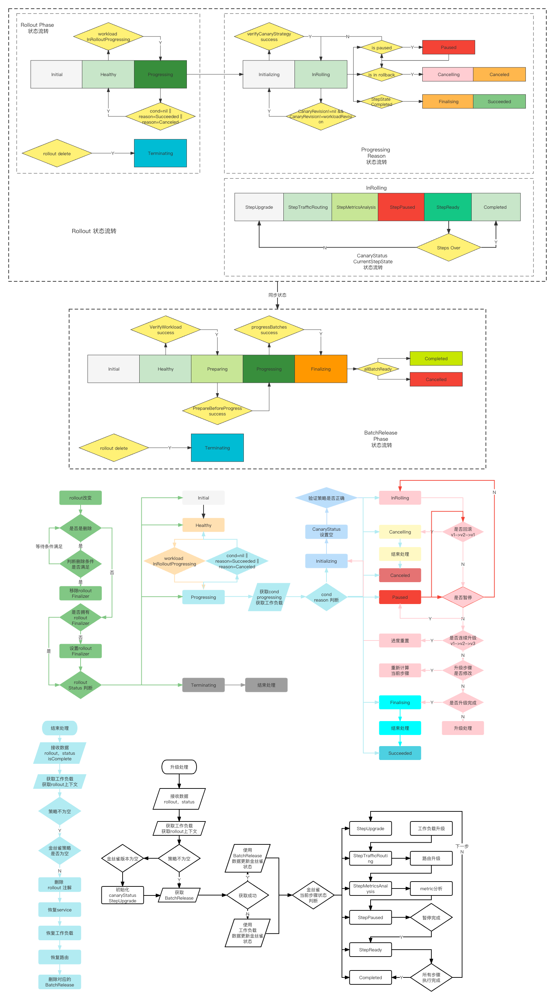

# Rollouts

## 介绍

rollout 是 openkruise 社区的同学为 deployment statefulset 等一系列的 kubernetes workload 提供的高级的部署能力，支持金丝雀，流量路由，渐进式交付等功能。

相较于k8s 提供的原生能力，rollouts 可以使我们的部署更加平滑和安全，并且它是无侵入性的，声明式的策略。

[github 地址](https://github.com/openkruise/rollouts)

## 工作负载选择

rollout 通过指定的 APIVersin, Kind,Name 的方式来确定一个工作负载，需要注意的是，指定的工作负载需要与 rollout 处于同一个命名空间。

如下示例：
表示的便是 rollout-demo 这个 rollout 所选定的对象是 default 命名空间下，工作负载类型为 Deployment，apiVersion 是 apps/v1 ，名字为 echosever 的工作负载。

```yaml
apiVersion: rollouts.kruise.io/v1alpha1  
kind: Rollout  
metadata:  
  name: rollouts-demo
spec:  
  objectRef:  
    workloadRef:  
      apiVersion: apps/v1  
      kind: Deployment  
      name: echoserver
```

当前支持的 workload 有：
+ ReplicaSet
+ Deployment
+ Statefulset
	+ apps/v1
	+ apps.kruise.io/v1beta1
	+ apps.kruise.io/v1alpha1
+ Cloneset
	+ apps.kruise.io/v1alpha1

## 策略

选定好工作负载之后，我们就可以制定我们的部署/灰度策略了，在 rollout 中，给我们提供了金丝雀策略方案。同时，也给我们提供了一个策略开关，来让我们控制策略的开启和暂停。

而在策略中，则将其分为两部分，一部分策略的具体步骤，一部分是流量分发策略。

### 步骤

在步骤中，我们可以定义当前步骤我们希望达到的部署状态。如副本数，权重，步骤间的间隔等等。

如下所示：
我们定义了两个部署步骤，它将按照顺序执行：

+ 在第一个步骤中，表示我们期望部署的新版本的 workload 的副本数为旧版本的 20%，并且在达到期望后等待60s再执行下一步。
+ 在第二个步骤中，表示我们期望部署的新版本的 workload 的副本数为旧版本的 40%，并且在达到期望后不在自动执行下一步而需要手动确认。

```yaml
apiVersion: rollouts.kruise.io/v1alpha1  
kind: Rollout  
metadata:  
  name: rollouts-demo  
spec:  
  strategy:
    paused: false  
    canary:  
      steps:  
        - pause: 
            duration: 60
          replicas: 20%  
        - weight: 40  
          pause: {}  
          replicas: 40%  
```

需要注意的是：
1. spec.strategy.canary.step.pause.duration 为空时表示当前步骤达到期望后，需要手动跳到下一步。不为空时，则是等待对应的时间自动执行下一步。
2. weight 与  replicas 不能同时为空。
3. weight 表示路由流量的权重，当replicas 为空时，也表示副本数的占比。
4. replicas 表示需要每个步骤期待达到的副本数，可是数字也可是百分比，但数字需要在[0，100],百分比需要在[0%-100%]之间，对于量比较大的工作负载，我们也许可以这样去定义它每个步骤的副本数：3 5 10 15 30 50 100 1% 3% 5% 10% 15% 30% 50% 100% 。使得部署/灰度更加平滑。
5. 开始讲过，rollout 是声明式的策略，它表示的是你期望达到的状态，而不是你控制它去怎么做，所以 replicas 是一个期待值，而不是一个执行值。所以 rollout 要求，每个步骤中 replicas 的值是递增的。即，后一步的值，不能小于前一步。

### 流量分发

在某些特定场景下，我们希望为我们部署的新版本的 workload 分发一些流量用来验证或测试服务的可用性，这一点，在 rollout 中，则是由 TrafficRouting 进行管理的。

如下所示:
表示将在第一个步骤中，为新的工作负载路由5%的流量，其中 service 指的是稳定版本的工作负载的 service， rollout 将会基于这个 service 进行流量控制。

```yaml
apiVersion: rollouts.kruise.io/v1alpha1  
kind: Rollout  
metadata:  
  name: rollout-demo  
spec:  
  objectRef:  
    workloadRef:  
      apiVersion: apps/v1  
      kind: Deployment  
      name: echoserver  
  strategy:  
    canary:  
      steps:  
        - weight: 5  
          pause: {}  
          replicas: 20%  
      trafficRoutings:  
        - service: echoserver  
          ingress:  
            name: echoserver
```

当前支持的路由流量控制器的类型有：Nginx, Alb, Istio

## 状态流转

对于 rollout 而言，它完整的生命周期包含了以下阶段:
+ Initial
+ Healthy： 表示 rollout 是正常的。
+ Progressing : 表示 rollout 处于正在发布的状态。
+ Terminating : 表示 rollout 正在终止。

在 Progressing 阶段，表示工作负载的变更触发的 rollout 策略。
此时 Progressing 接管发布流程，她负载每个步骤的推动执行。其中它的状态变更主要有以下几种：
+ Initializing
+ InRolling
+ Finalising
+ Succeeded
+ Cancelling
+ Canceled
+ Paused

每个步骤的执行也分为几个阶段，它的状态流转为：
+ StepUpgrade
+ StepTrafficRouting
+ StepMetricsAnalysis
+ StepPaused
+ StepReady
+ Completed

在 Terminating 阶段，表示用户正在删除 rollout ,rollout 的生命正在终止，终止时也分为两个阶段：
+ InTerminating
+ Completed

### 状态流转图



## 使用示例

[官方示例](https://github.com/openkruise/rollouts/blob/master/docs/tutorials/basic_usage.md)

## Q&A
Q:第一次部署工作负载会触发 rollout 吗？
A:不会，第一次部署工作负载 rollout 不会被触发，工作负载仍然按照 k8s 原有的逻辑进行运作。

Q:rollout 会在什么时候触发？
A:会在工作负载发生变更时触发。

Q:只要变更工作负载就会触发吗？
A:不是，需要变更工作负载里 spec 下除 replicas 和 paused 字段外的其他字段。status的变更和刚刚说到的字段变更不会触发rollout。

Q：可以在 rollout 正在进行变更的时候发版或者回滚吗？
A：可以，rollout 支持连续发版。